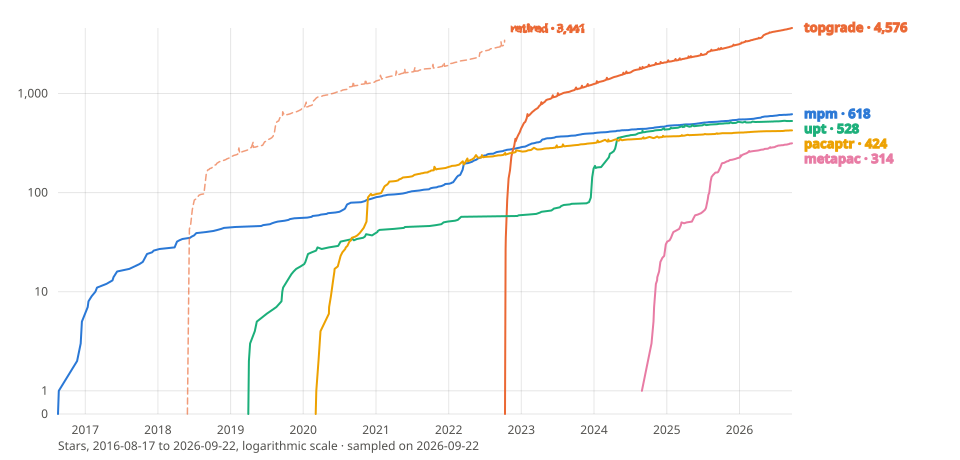
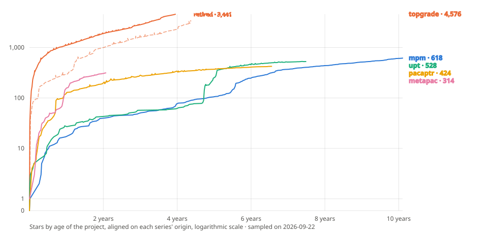

# {octicon}`trophy` Benchmark

Attempting to unify all package managers is a Sisyphean task.

This did not prevent me or others to try to solve that problem. It is not easy to explain why
but [there might be a greater need for such tools](augmentations.md) out there. Here is a list of some related projects I stumbled into and how they compares to `mpm`.

## Features

<!-- The absolute cli-parameters.html links below are deliberate: their
     #mpm-* anchors are section ids generated by click-extra's click:tree
     directive, which MyST's cross-reference checker cannot see, so any
     relative form would warn as a missing target while resolving fine. -->

| Feature                                                              |                            `mpm`                             |                              `topgrade`[^topgrade]                               |                              `upt`[^upt]                               |                          `pacaptr`[^pacaptr]                           |                                `metapac`[^metapac]                                |                                `brew`[^brew]                                |
| -------------------------------------------------------------------- | :----------------------------------------------------------: | :------------------------------------------------------------------------------: | :--------------------------------------------------------------------: | :--------------------------------------------------------------------: | :-------------------------------------------------------------------------------: | :-------------------------------------------------------------------------: |
| [Package manager autodetection](configuration.md#default-managers)   |           [✅](configuration.md#default-managers)            |            [✅](https://github.com/topgrade-rs/topgrade#introduction)            |             [✅](https://github.com/sigoden/upt#os-tools)              |   [✅](https://github.com/rami3l/pacaptr#supported-package-managers)   | [❌](https://github.com/ripytide/metapac/blob/v0.10.1/README.md#enable-backends)  |                                                                             |
| [Unified CLI and options](cli-parameters.md)                         |                   [✅](cli-parameters.md)                    |                                        ✅                                        |     [✅](https://github.com/sigoden/upt#unified-command-interface)     |          [✅](https://github.com/rami3l/pacaptr#why-pacaptr)           |         [✅](https://github.com/ripytide/metapac/blob/v0.10.1/src/cli.rs)         |                                     ✅                                      |
| [Multi-PM execution](configuration.md#selecting-managers)            |          [✅](configuration.md#selecting-managers)           |            [✅](https://github.com/topgrade-rs/topgrade#introduction)            | [❌](https://github.com/sigoden/upt/issues/60#issuecomment-2560419544) |           [❌](https://github.com/rami3l/pacaptr/issues/502)           |      [✅](https://github.com/ripytide/metapac/blob/v0.10.1/README.md#config)      |             [✅](https://docs.brew.sh/Brew-Bundle-and-Brewfile)             |
| [Concurrent multi-PM execution](configuration.md#global-options)     |            [✅](configuration.md#global-options)             |             [❌](https://github.com/topgrade-rs/topgrade/issues/877)             | [❌](https://github.com/sigoden/upt/issues/60#issuecomment-2560419544) |           [❌](https://github.com/rami3l/pacaptr/issues/502)           |    [❌](https://github.com/ripytide/metapac/blob/v0.10.1/src/core.rs#L63-L68)     |                                     ✅                                      |
| [Package manager priority](configuration.md#overlapping-managers)    |         [✅](configuration.md#overlapping-managers)          |  [✅](https://github.com/topgrade-rs/topgrade/blob/v17.8.0/config.example.toml)  |             [✅](https://github.com/sigoden/upt#os-tools)              |   [❌](https://github.com/rami3l/pacaptr#supported-package-managers)   |   [❌](https://github.com/ripytide/metapac/issues/107#issuecomment-3254591842)    |                                                                             |
| [Consolidated output](output-formats.md)                             |                   [✅](output-formats.md)                    | [❌](https://github.com/topgrade-rs/topgrade/issues/943#issuecomment-2408791591) | [❌](https://github.com/sigoden/upt/issues/60#issuecomment-2560419544) |           [❌](https://github.com/rami3l/pacaptr/issues/502)           |    [✅](https://github.com/ripytide/metapac/blob/v0.10.1/src/core.rs#L78-L93)     |                                                                             |
| [Configurable output](configuration.md#available-options)            |           [✅](configuration.md#available-options)           |                                                                                  |                                                                        |                                                                        |                                                                                   |                                                                             |
| [Sortable output](configuration.md#global-options)                   |            [✅](configuration.md#global-options)             |                                                                                  |                                                                        |                                                                        |                                                                                   |                                                                             |
| [Colored output](output-formats.md)                                  |                   [✅](output-formats.md)                    |                                        ✅                                        |                                                                        |                                                                        |                [✅](https://github.com/ripytide/metapac/issues/6)                 |                                     ✅                                      |
| [Accessible output](output-formats.md#accessibility)                 |            [✅](output-formats.md#accessibility)             |                                                                                  |                                                                        |                                                                        |                                                                                   |                                                                             |
| [Version parsing and diff](cli-parameters.md#mpm-outdated)           |             [✅](cli-parameters.md#mpm-outdated)             | [❌](https://github.com/topgrade-rs/topgrade/issues/943#issuecomment-2408791591) |                                                                        |                                                                        |   [❌](https://github.com/ripytide/metapac/issues/217#issuecomment-3940735027)    |                     [✅](https://docs.brew.sh/Manpage)                      |
| [Skip auto-updating packages](configuration.md#global-options)       |            [✅](configuration.md#global-options)             |                                                                                  |                                                                        |                                                                        |                                                                                   |                     [✅](https://docs.brew.sh/Manpage)                      |
| [purl support](augmentations.md#standard-package-urls-purl)          |      [✅](augmentations.md#standard-package-urls-purl)       |                                                                                  |                                                                        |                                                                        |                                                                                   |                [✅](https://docs.brew.sh/rubydoc/SBOM.html)                 |
| [Exact and fuzzy search](augmentations.md#better-search)             |             [✅](augmentations.md#better-search)             |                                                                                  |                                                                        |                                                                        |                                                                                   |                     [✅](https://docs.brew.sh/Manpage)                      |
| [JSON export](output-formats.md#json)                                |                 [✅](output-formats.md#json)                 |                                                                                  |                                                                        |                                                                        |               [❌](https://github.com/ripytide/metapac/issues/221)                |                     [✅](https://docs.brew.sh/Manpage)                      |
| [CSV export](output-formats.md#csv)                                  |                 [✅](output-formats.md#csv)                  |                                                                                  |                                                                        |                                                                        |                                                                                   |                                                                             |
| [Markup export](output-formats.md)                                   |                   [✅](output-formats.md)                    |                                                                                  |                                                                        |                                                                        |                                                                                   |                                                                             |
| [SBOM export](sbom.md)                                               |                        [✅](sbom.md)                         |                                                                                  |                                                                        |                                                                        |                                                                                   |                                                                             |
| [Vulnerability scan](sbom.md#vulnerability-scanning)                 |             [✅](sbom.md#vulnerability-scanning)             |                                                                                  |                                                                        |                                                                        |                                                                                   |                                                                             |
| [Configuration file](configuration.md)                               |                    [✅](configuration.md)                    |         [✅](https://github.com/topgrade-rs/topgrade#configuration-path)         |                                                                        |         [✅](https://github.com/rami3l/pacaptr#configuration)          |      [✅](https://github.com/ripytide/metapac/blob/v0.10.1/README.md#config)      |                                     ✅                                      |
| [Per-manager overrides](overrides.md)                                |                      [✅](overrides.md)                      |  [✅](https://github.com/topgrade-rs/topgrade/blob/v17.8.0/config.example.toml)  |                                                                        |                                                                        |      [✅](https://github.com/ripytide/metapac/blob/v0.10.1/README.md#config)      |                                                                             |
| [Non-interactive](configuration.md#global-options)                   |            [✅](configuration.md#global-options)             |     [✅](https://github.com/topgrade-rs/topgrade/blob/v17.8.0/src/config.rs)     | [✅](https://github.com/sigoden/upt/blob/v0.9.0/src/vendor.rs#L80-L91) | [✅](https://github.com/rami3l/pacaptr#--yes---noconfirm---no-confirm) |     [✅](https://github.com/ripytide/metapac/blob/v0.10.1/src/cli.rs#L80-L83)     |                     [✅](https://docs.brew.sh/Manpage)                      |
| [Dry-run](configuration.md#global-options)                           |            [✅](configuration.md#global-options)             |     [✅](https://github.com/topgrade-rs/topgrade/blob/v17.8.0/src/config.rs)     |  [✅](https://github.com/sigoden/upt/blob/v0.9.0/src/main.rs#L37-L42)  |       [✅](https://github.com/rami3l/pacaptr#--dryrun---dry-run)       |   [❌](https://github.com/ripytide/metapac/blob/v0.10.1/src/core.rs#L120-L137)    |                     [✅](https://docs.brew.sh/Manpage)                      |
| [Command plan](augmentations.md#inspect-the-plan-before-running)     |    [✅](augmentations.md#inspect-the-plan-before-running)    |                                                                                  |  [✅](https://github.com/sigoden/upt/blob/v0.9.0/src/main.rs#L37-L42)  |       [✅](https://github.com/rami3l/pacaptr#--dryrun---dry-run)       |                                                                                   |                                                                             |
| [Per-call timeout](configuration.md#global-options)                  |            [✅](configuration.md#global-options)             |                                                                                  |                                                                        |                                                                        |                                                                                   |                                                                             |
| [Offline by default](configuration.md#global-options)                |            [✅](configuration.md#global-options)             |                                                                                  |                                                                        |                                                                        |                                                                                   |                                                                             |
| [Sudo elevation](sudo.md)                                            |                        [✅](sudo.md)                         |  [✅](https://github.com/topgrade-rs/topgrade/blob/v17.8.0/config.example.toml)  |             [❌](https://github.com/sigoden/upt/issues/38)             |   [✅](https://github.com/rami3l/pacaptr#automatic-sudo-invocation)    |    [✅](https://github.com/ripytide/metapac/issues/80#issuecomment-2888561244)    |                       [❌](https://docs.brew.sh/FAQ)                        |
| [Supply-chain cooldown](cooldown.md)                                 |                      [✅](cooldown.md)                       |            [❌](https://github.com/topgrade-rs/topgrade/issues/1890)             |                                                                        |                                                                        |                                                                                   | [❌](https://github.com/Homebrew/brew/issues/22659#issuecomment-4680803443) |
| [Desktop notifications](gnome-shell.md)                              |                     [✅](gnome-shell.md)                     |     [✅](https://github.com/topgrade-rs/topgrade/blob/v17.8.0/src/config.rs)     |                                                                        |                                                                        |                                                                                   |                                                                             |
| [Bash auto-completion](install.md#shell-completion)                  |              [✅](install.md#shell-completion)               |     [✅](https://github.com/topgrade-rs/topgrade/blob/v17.8.0/src/config.rs)     |                                                                        |           [❌](https://github.com/rami3l/pacaptr/issues/363)           |     [✅](https://github.com/ripytide/metapac/blob/v0.10.1/src/completions.rs)     |                 [✅](https://docs.brew.sh/Shell-Completion)                 |
| [Zsh auto-completion](install.md#shell-completion)                   |              [✅](install.md#shell-completion)               |     [✅](https://github.com/topgrade-rs/topgrade/blob/v17.8.0/src/config.rs)     |                                                                        |           [❌](https://github.com/rami3l/pacaptr/issues/363)           |     [✅](https://github.com/ripytide/metapac/blob/v0.10.1/src/completions.rs)     |                 [✅](https://docs.brew.sh/Shell-Completion)                 |
| [Fish auto-completion](install.md#shell-completion)                  |              [✅](install.md#shell-completion)               |     [✅](https://github.com/topgrade-rs/topgrade/blob/v17.8.0/src/config.rs)     |                                                                        |           [❌](https://github.com/rami3l/pacaptr/issues/363)           |     [✅](https://github.com/ripytide/metapac/blob/v0.10.1/src/completions.rs)     |                 [✅](https://docs.brew.sh/Shell-Completion)                 |
| [Man pages](install.md#man-pages)                                    |                  [✅](install.md#man-pages)                  |                                                                                  |                                                                        |                                                                        |                                                                                   |                     [✅](https://docs.brew.sh/Manpage)                      |
| [XKCD #1654](duplicates.md#install-with-the-first-available-manager) | [✅](duplicates.md#install-with-the-first-available-manager) |                                                                                  | [❌](https://github.com/sigoden/upt/issues/60#issuecomment-2560419544) |                                                                        | [✅](https://github.com/ripytide/metapac/blob/v0.10.1/README.md#obligatory-xkcds) |                                                                             |
| [GNOME Shell extension](gnome-shell.md)                              |                     [✅](gnome-shell.md)                     |                                                                                  |                                                                        |                                                                        |                                                                                   |                                                                             |
| [SwiftBar/Xbar plugin](bar-plugin.md)                                |                     [✅](bar-plugin.md)                      |                                                                                  |                                                                        |                                                                        |                                                                                   |                                                                             |
| [Apply manifest (declarative install)](dump.md)                      |                        [✅](dump.md)                         |                                                                                  |                                                                        |                                                                        |   [✅](https://github.com/ripytide/metapac/blob/v0.10.1/README.md#declarative)    |             [✅](https://docs.brew.sh/Brew-Bundle-and-Brewfile)             |
| [Backend-prefixed package IDs](cli-parameters.md#mpm-install)        |             [✅](cli-parameters.md#mpm-install)              |                                                                                  |                                                                        |                                                                        |                                                                                   |                                                                             |

## Operations

Every cell links to its evidence: a ✅ to the documentation, CLI declaration or source line implementing the operation, a 🟡 to the proof the capability only exists bundled inside another one, and a ❌ to the upstream statement of scope ruling it out. A blank cell means no citable source was found either way.

<!-- Cell rulings applied consistently across columns:
     - Each ❌ links to the upstream statement that rules the operation out: topgrade's
       definition of a step as "something that can be upgraded", upt's closed `Task` enum
       of the tasks every vendor is aliased to, the list of pacman methods pacaptr
       implements, and either metapac's subcommand enum or the issue where its maintainer
       declined the feature. A missing feature nobody upstream has ruled on stays blank.
     - "Remove a package with its orphans" is the scoped cascade (`mpm remove --orphans`,
       `apt autoremove <pkg>`, pacman `-Rs <pkg>`), distinct from the system-wide sweep
       of "Cleanup: orphans" and from the read-only "List orphaned dependencies".
     - "List explicitly installed packages (leaves)" credits the explicit-install listing
       (`brew leaves`, pacman-style `-Qe`, and metapac's `unmanaged`, which reports the
       explicitly-installed packages missing from its group files).
     - "Locate binaries" credits the reverse lookup from a file to the package owning it
       (`brew which-formula`, pacman-style `-Qo`), the closest any competitor gets to
       `mpm which`'s search of the user's own PATH.
     - A 🟡 links to the evidence that the capability only exists bundled inside another
       operation and cannot be invoked in isolation (topgrade's index refresh and cleanup
       run only as part of an upgrade run, pacaptr's orphan sweep only inside `-Rs`/`-Rns`
       removals, metapac's only as a by-product of `clean`).
     - metapac's `sync` subcommand reconciles installed packages against declared TOML
       group files (mpm's "Restore" semantics), while its `refresh` subcommand updates
       backend package indexes (mpm's "Sync" semantics) — the verb names are a false
       friend across the two tools, see the linked source for each row. -->

| Operation                                   |                      `mpm`                       |                                   `topgrade`[^topgrade]                                    |                               `upt`[^upt]                                |                              `pacaptr`[^pacaptr]                              |                                         `metapac`[^metapac]                                          |                    `brew`[^brew]                    |
| ------------------------------------------- | :----------------------------------------------: | :----------------------------------------------------------------------------------------: | :----------------------------------------------------------------------: | :---------------------------------------------------------------------------: | :--------------------------------------------------------------------------------------------------: | :-------------------------------------------------: |
| List available managers                     |       [✅](cli-parameters.md#mpm-managers)       |     [❌](https://github.com/topgrade-rs/topgrade/blob/v17.8.0/CONTRIBUTING.md#L36-L39)     |   [❌](https://github.com/sigoden/upt/blob/v0.9.0/src/task.rs#L1-L19)    |    [❌](https://github.com/rami3l/pacaptr/blob/v0.23.1/src/pm.rs#L44-L146)    |              [✅](https://github.com/ripytide/metapac/blob/v0.10.1/src/cli.rs#L95-L96)               |                                                     |
| List installed packages                     |      [✅](cli-parameters.md#mpm-installed)       |     [❌](https://github.com/topgrade-rs/topgrade/blob/v17.8.0/CONTRIBUTING.md#L36-L39)     |           [✅](https://github.com/sigoden/upt#supported-tools)           |    [✅](https://github.com/rami3l/pacaptr/blob/v0.23.1/src/pm.rs#L52-L53)     |              [❌](https://github.com/ripytide/metapac/blob/v0.10.1/src/cli.rs#L26-L37)               |         [✅](https://docs.brew.sh/Manpage)          |
| List duplicate packages                     | [✅](duplicates.md#audit-existing-installations) |     [❌](https://github.com/topgrade-rs/topgrade/blob/v17.8.0/CONTRIBUTING.md#L36-L39)     |   [❌](https://github.com/sigoden/upt/blob/v0.9.0/src/task.rs#L1-L19)    |    [❌](https://github.com/rami3l/pacaptr/blob/v0.23.1/src/pm.rs#L44-L146)    |              [❌](https://github.com/ripytide/metapac/blob/v0.10.1/src/cli.rs#L26-L37)               |                                                     |
| List outdated packages                      |       [✅](cli-parameters.md#mpm-outdated)       |     [❌](https://github.com/topgrade-rs/topgrade/blob/v17.8.0/CONTRIBUTING.md#L36-L39)     |   [❌](https://github.com/sigoden/upt/blob/v0.9.0/src/task.rs#L1-L19)    |    [✅](https://github.com/rami3l/pacaptr/blob/v0.23.1/src/pm.rs#L85-L86)     |             [❌](https://github.com/ripytide/metapac/issues/217#issuecomment-3940735027)             |         [✅](https://docs.brew.sh/Manpage)          |
| List orphaned dependencies                  |       [✅](cli-parameters.md#mpm-orphans)        |     [❌](https://github.com/topgrade-rs/topgrade/blob/v17.8.0/CONTRIBUTING.md#L36-L39)     |   [❌](https://github.com/sigoden/upt/blob/v0.9.0/src/task.rs#L1-L19)    |    [❌](https://github.com/rami3l/pacaptr/blob/v0.23.1/src/pm.rs#L44-L146)    |              [❌](https://github.com/ripytide/metapac/blob/v0.10.1/src/cli.rs#L26-L37)               |         [✅](https://docs.brew.sh/Manpage)          |
| Search packages                             |        [✅](cli-parameters.md#mpm-search)        |     [❌](https://github.com/topgrade-rs/topgrade/blob/v17.8.0/CONTRIBUTING.md#L36-L39)     |           [✅](https://github.com/sigoden/upt#supported-tools)           |   [✅](https://github.com/rami3l/pacaptr/blob/v0.23.1/src/pm.rs#L129-L130)    |              [❌](https://github.com/ripytide/metapac/blob/v0.10.1/src/cli.rs#L26-L37)               |         [✅](https://docs.brew.sh/Manpage)          |
| Locate binaries (`which` command)           |        [✅](cli-parameters.md#mpm-which)         |     [❌](https://github.com/topgrade-rs/topgrade/blob/v17.8.0/CONTRIBUTING.md#L36-L39)     |   [❌](https://github.com/sigoden/upt/blob/v0.9.0/src/task.rs#L1-L19)    |    [✅](https://github.com/rami3l/pacaptr/blob/v0.23.1/src/pm.rs#L76-L77)     |              [❌](https://github.com/ripytide/metapac/blob/v0.10.1/src/cli.rs#L26-L37)               |         [✅](https://docs.brew.sh/Manpage)          |
| Install a package                           |       [✅](cli-parameters.md#mpm-install)        |     [❌](https://github.com/topgrade-rs/topgrade/blob/v17.8.0/CONTRIBUTING.md#L36-L39)     |           [✅](https://github.com/sigoden/upt#supported-tools)           |   [✅](https://github.com/rami3l/pacaptr/blob/v0.23.1/src/pm.rs#L105-L106)    |                         [❌](https://github.com/ripytide/metapac/issues/197)                         |         [✅](https://docs.brew.sh/Manpage)          |
| Remove / Uninstall a package                |        [✅](cli-parameters.md#mpm-remove)        |     [❌](https://github.com/topgrade-rs/topgrade/blob/v17.8.0/CONTRIBUTING.md#L36-L39)     |           [✅](https://github.com/sigoden/upt#supported-tools)           |    [✅](https://github.com/rami3l/pacaptr/blob/v0.23.1/src/pm.rs#L88-L89)     |                         [❌](https://github.com/ripytide/metapac/issues/197)                         |         [✅](https://docs.brew.sh/Manpage)          |
| Remove a package with its orphans           |        [✅](cli-parameters.md#mpm-remove)        |     [❌](https://github.com/topgrade-rs/topgrade/blob/v17.8.0/CONTRIBUTING.md#L36-L39)     | [✅](https://github.com/sigoden/upt/blob/v0.9.0/src/vendor.rs#L249-L252) |    [✅](https://github.com/rami3l/pacaptr/blob/v0.23.1/src/pm.rs#L98-L100)    |                         [❌](https://github.com/ripytide/metapac/issues/197)                         |                                                     |
| Upgrade single package                      |       [✅](cli-parameters.md#mpm-upgrade)        |     [❌](https://github.com/topgrade-rs/topgrade/blob/v17.8.0/src/config.rs#L951-L957)     |           [✅](https://github.com/sigoden/upt#supported-tools)           |   [✅](https://github.com/rami3l/pacaptr/blob/v0.23.1/src/pm.rs#L105-L106)    |              [✅](https://github.com/ripytide/metapac/blob/v0.10.1/src/cli.rs#L41-L50)               |         [✅](https://docs.brew.sh/Manpage)          |
| Upgrade all packages                        |       [✅](cli-parameters.md#mpm-upgrade)        |                 [✅](https://github.com/topgrade-rs/topgrade#introduction)                 |           [✅](https://github.com/sigoden/upt#supported-tools)           |   [✅](https://github.com/rami3l/pacaptr/blob/v0.23.1/src/pm.rs#L132-L133)    |              [✅](https://github.com/ripytide/metapac/blob/v0.10.1/src/core.rs#L63-L68)              |         [✅](https://docs.brew.sh/Manpage)          |
| Sync                                        |         [✅](cli-parameters.md#mpm-sync)         | [🟡](https://github.com/topgrade-rs/topgrade/blob/v17.8.0/src/steps/os/linux.rs#L552-L573) |           [✅](https://github.com/sigoden/upt#supported-tools)           |   [✅](https://github.com/rami3l/pacaptr/blob/v0.23.1/src/pm.rs#L141-L142)    | [✅](https://github.com/ripytide/metapac/blob/v0.10.1/README.md#refreshing-backend-package-metadata) |         [✅](https://docs.brew.sh/Manpage)          |
| Cleanup: caches                             |       [✅](cli-parameters.md#mpm-cleanup)        |   [🟡](https://github.com/topgrade-rs/topgrade/blob/v17.8.0/config.example.toml#L85-L86)   |   [❌](https://github.com/sigoden/upt/blob/v0.9.0/src/task.rs#L1-L19)    |   [✅](https://github.com/rami3l/pacaptr/blob/v0.23.1/src/pm.rs#L108-L109)    |             [✅](https://github.com/ripytide/metapac/blob/v0.10.1/src/core.rs#L225-L229)             |         [✅](https://docs.brew.sh/Manpage)          |
| Cleanup: orphans                            |       [✅](cli-parameters.md#mpm-cleanup)        |   [🟡](https://github.com/topgrade-rs/topgrade/blob/v17.8.0/config.example.toml#L85-L86)   |   [❌](https://github.com/sigoden/upt/blob/v0.9.0/src/task.rs#L1-L19)    | [🟡](https://github.com/rami3l/pacaptr/blob/v0.23.1/src/pm/brew.rs#L140-L157) |             [🟡](https://github.com/ripytide/metapac/issues/97#issuecomment-3127818916)              |         [✅](https://docs.brew.sh/Manpage)          |
| Backup / Lock / Freeze                      |         [✅](cli-parameters.md#mpm-dump)         |     [❌](https://github.com/topgrade-rs/topgrade/blob/v17.8.0/CONTRIBUTING.md#L36-L39)     |   [❌](https://github.com/sigoden/upt/blob/v0.9.0/src/task.rs#L1-L19)    |    [❌](https://github.com/rami3l/pacaptr/blob/v0.23.1/src/pm.rs#L44-L146)    |             [❌](https://github.com/ripytide/metapac/issues/217#issuecomment-3940735027)             | [✅](https://docs.brew.sh/Brew-Bundle-and-Brewfile) |
| Restore                                     |       [✅](cli-parameters.md#mpm-restore)        |     [❌](https://github.com/topgrade-rs/topgrade/blob/v17.8.0/CONTRIBUTING.md#L36-L39)     |   [❌](https://github.com/sigoden/upt/blob/v0.9.0/src/task.rs#L1-L19)    |    [❌](https://github.com/rami3l/pacaptr/blob/v0.23.1/src/pm.rs#L44-L146)    |             [✅](https://github.com/ripytide/metapac/blob/v0.10.1/src/core.rs#L120-L137)             | [✅](https://docs.brew.sh/Brew-Bundle-and-Brewfile) |
| List explicitly installed packages (leaves) |                                                  |     [❌](https://github.com/topgrade-rs/topgrade/blob/v17.8.0/CONTRIBUTING.md#L36-L39)     |   [❌](https://github.com/sigoden/upt/blob/v0.9.0/src/task.rs#L1-L19)    |    [✅](https://github.com/rami3l/pacaptr/blob/v0.23.1/src/pm.rs#L58-L59)     |              [✅](https://github.com/ripytide/metapac/blob/v0.10.1/src/cli.rs#L87-L92)               |         [✅](https://docs.brew.sh/Manpage)          |
| Pin / Unpin version                         |                                                  |     [❌](https://github.com/topgrade-rs/topgrade/blob/v17.8.0/CONTRIBUTING.md#L36-L39)     |   [❌](https://github.com/sigoden/upt/blob/v0.9.0/src/task.rs#L1-L19)    |    [❌](https://github.com/rami3l/pacaptr/blob/v0.23.1/src/pm.rs#L44-L146)    |             [❌](https://github.com/ripytide/metapac/issues/217#issuecomment-3940735027)             |         [✅](https://docs.brew.sh/Manpage)          |
| Doctor / diagnostics                        |        [✅](cli-parameters.md#mpm-doctor)        |     [❌](https://github.com/topgrade-rs/topgrade/blob/v17.8.0/CONTRIBUTING.md#L36-L39)     |   [❌](https://github.com/sigoden/upt/blob/v0.9.0/src/task.rs#L1-L19)    |    [❌](https://github.com/rami3l/pacaptr/blob/v0.23.1/src/pm.rs#L44-L146)    |              [❌](https://github.com/ripytide/metapac/blob/v0.10.1/src/cli.rs#L26-L37)               |         [✅](https://docs.brew.sh/Manpage)          |
| Services management                         |                                                  |     [❌](https://github.com/topgrade-rs/topgrade/blob/v17.8.0/CONTRIBUTING.md#L36-L39)     |   [❌](https://github.com/sigoden/upt/blob/v0.9.0/src/task.rs#L1-L19)    |    [❌](https://github.com/rami3l/pacaptr/blob/v0.23.1/src/pm.rs#L44-L146)    |             [❌](https://github.com/ripytide/metapac/issues/141#issuecomment-3295623163)             |         [✅](https://docs.brew.sh/Manpage)          |

`mpm`'s SBOM export sits in a different category from the package-manager front-ends benchmarked here. It is compared against dedicated SBOM and software-composition-analysis tools (Syft, Trivy, cdxgen, component-detection) in [the SBOM documentation](sbom.md).

## Package manager support

Every glyph used below:

| Glyph | Meaning                                                                                                                              |
| :---- | :----------------------------------------------------------------------------------------------------------------------------------- |
| ✅    | Supported. In the `mpm` column, links to the class implementing the manager; in a competitor's, to whatever documents its support.   |
| ⚠️    | Wrapped by `mpm` and usable, but its [upstream is gone](managers.md).                                                                |
| 🛟    | Not wrapped, yet still reachable through [`mpm upgrade --topgrade`](unsupported.md), which upgrades whatever it detects on the host. |
| ☠️    | Never wrapped, and its [upstream is retired](unsupported.md).                                                                        |
| ❌    | Never wrapped: a live tool [declined on its own merits](unsupported.md).                                                             |
| 🟡    | Coarse support a competitor cannot invoke for this manager alone, only as part of a wider sweep.                                     |
| Blank | Nobody has assessed that tool yet, and [it is very likely available for the writing](add-new-manager.md).                            |

```{python:render}
:mirror:
from meta_package_manager._docs import benchmark_managers_table

print(benchmark_managers_table())
```

<!-- mirror -->

| Manager                                                                      |                                                          `mpm`                                                           |                              `topgrade`[^topgrade]                               | `upt`[^upt] | `pacaptr`[^pacaptr] | `metapac`[^metapac] |
| :--------------------------------------------------------------------------- | :----------------------------------------------------------------------------------------------------------------------: | :------------------------------------------------------------------------------: | :---------: | :-----------------: | :-----------------: |
| [`am`](managers/am.md)                                                       |        [✅](https://github.com/kdeldycke/meta-package-manager/blob/main/meta_package_manager/managers/am.py#L46)         |                                        ✅                                        |             |                     |                     |
| [`android-studio`](https://developer.android.com/studio)                     |                                        [🛟](unsupported.md#jetbrains-ide-plugins)                                        |                                        ✅                                        |             |                     |                     |
| [`antibody`](https://getantibody.github.io)                                  |                                              [🛟](unsupported.md#antibody)                                               | [🟡](https://github.com/topgrade-rs/topgrade/issues/961#issuecomment-2420924279) |             |                     |                     |
| [`antidote`](managers/antidote.md)                                           |     [✅](https://github.com/kdeldycke/meta-package-manager/blob/main/meta_package_manager/managers/antidote.py#L87)      | [🟡](https://github.com/topgrade-rs/topgrade/issues/961#issuecomment-2420924279) |             |                     |                     |
| [`antigen`](managers/antigen.md)                                             |      [✅](https://github.com/kdeldycke/meta-package-manager/blob/main/meta_package_manager/managers/antigen.py#L60)      | [🟡](https://github.com/topgrade-rs/topgrade/issues/961#issuecomment-2420924279) |             |                     |                     |
| [`antigravity`](https://antigravity.google)                                  |                                             [🛟](unsupported.md#antigravity)                                             |                                        ✅                                        |             |                     |                     |
| [`apk`](managers/apk.md)                                                     |        [✅](https://github.com/kdeldycke/meta-package-manager/blob/main/meta_package_manager/managers/apk.py#L33)        |                                        ✅                                        |     ✅      |         ✅          |                     |
| [`apm`](managers/apm.md)                                                     |        [⚠️](https://github.com/kdeldycke/meta-package-manager/blob/main/meta_package_manager/managers/apm.py#L31)        |                                        ✅                                        |             |                     |                     |
| [`app-man`](https://github.com/ivan-hc/AppMan)                               |                                               [🛟](unsupported.md#app-man)                                               |                                        ✅                                        |             |                     |                     |
| [`apt`](managers/apt.md)                                                     |        [✅](https://github.com/kdeldycke/meta-package-manager/blob/main/meta_package_manager/managers/apt.py#L33)        |                                        ✅                                        |     ✅      |         ✅          |         ✅          |
| [`apt-cyg`](managers/apt-cyg.md)                                             |       [⚠️](https://github.com/kdeldycke/meta-package-manager/blob/main/meta_package_manager/managers/apt_cyg.toml)       |                                                                                  |             |                     |                     |
| [`apt-mint`](managers/apt-mint.md)                                           |       [✅](https://github.com/kdeldycke/meta-package-manager/blob/main/meta_package_manager/managers/apt.py#L383)        |                                                                                  |             |                     |                     |
| [`aqua`](https://aquaproj.github.io)                                         |                                                                                                                          |                                        ✅                                        |             |                     |                     |
| [`asdf`](managers/asdf.md)                                                   |       [✅](https://github.com/kdeldycke/meta-package-manager/blob/main/meta_package_manager/managers/asdf.py#L33)        |                                        ✅                                        |             |                     |                     |
| [`atuin`](https://atuin.sh)                                                  |                                     [🛟](unsupported.md#self-updating-applications)                                      |                                        ✅                                        |             |                     |                     |
| [`aura`](https://github.com/fosskers/aura)                                   |                                                                                                                          |                                        ✅                                        |             |                     |                     |
| [`auto-cpufreq`](https://github.com/AdnanHodzic/auto-cpufreq)                |                                            [🛟](unsupported.md#auto-cpufreq)                                             |                                        ✅                                        |             |                     |                     |
| [`basalt`](managers/basalt.md)                                               |       [✅](https://github.com/kdeldycke/meta-package-manager/blob/main/meta_package_manager/managers/basalt.toml)        |                                                                                  |             |                     |                     |
| [`bash-it`](https://bash-it.readthedocs.io)                                  |                                               [🛟](unsupported.md#bash-it)                                               | [🟡](https://github.com/topgrade-rs/topgrade/issues/961#issuecomment-2420924279) |             |                     |                     |
| [`basher`](https://github.com/basherpm/basher)                               |                                               [❌](unsupported.md#basher)                                                |                                                                                  |             |                     |                     |
| [`bin`](managers/bin.md)                                                     |        [✅](https://github.com/kdeldycke/meta-package-manager/blob/main/meta_package_manager/managers/bin.py#L53)        |                                        ✅                                        |             |                     |                     |
| [`bob`](managers/bob.md)                                                     |         [✅](https://github.com/kdeldycke/meta-package-manager/blob/main/meta_package_manager/managers/bob.toml)         |                                        ✅                                        |             |                     |                     |
| [`bpkg`](managers/bpkg.md)                                                   |        [✅](https://github.com/kdeldycke/meta-package-manager/blob/main/meta_package_manager/managers/bpkg.toml)         |                                                                                  |             |                     |                     |
| [`bpm`](https://github.com/bpm-rocks/bpm)                                    |                                                 [☠️](unsupported.md#bpm)                                                 |                                                                                  |             |                     |                     |
| [`brew`](managers/brew.md)                                                   |     [✅](https://github.com/kdeldycke/meta-package-manager/blob/main/meta_package_manager/managers/homebrew.py#L901)     |                                        ✅                                        |     ✅      |         ✅          |         ✅          |
| [`bun`](managers/bun.md)                                                     |         [✅](https://github.com/kdeldycke/meta-package-manager/blob/main/meta_package_manager/managers/bun.toml)         |                                        ✅                                        |             |                     |         ✅          |
| [`cabal`](https://www.haskell.org/cabal/)                                    |                                                                                                                          |             [❌](https://github.com/topgrade-rs/topgrade/issues/320)             |             |                     |                     |
| [`cards`](https://nutyx.org)                                                 |                                                                                                                          |                                                                                  |     ✅      |                     |                     |
| [`cargo`](managers/cargo.md)                                                 |        [✅](https://github.com/kdeldycke/meta-package-manager/blob/main/meta_package_manager/managers/cargo.toml)        |                                        ✅                                        |             |                     |         ✅          |
| [`cask`](managers/cask.md)                                                   |     [✅](https://github.com/kdeldycke/meta-package-manager/blob/main/meta_package_manager/managers/homebrew.py#L975)     |                                        ✅                                        |             |         ✅          |                     |
| [`cave`](managers/cave.md)                                                   |        [✅](https://github.com/kdeldycke/meta-package-manager/blob/main/meta_package_manager/managers/cave.toml)         |                                                                                  |             |                     |                     |
| [`certbot`](https://certbot.eff.org)                                         |                                               [🛟](unsupported.md#certbot)                                               |                                        ✅                                        |             |                     |                     |
| [`chezmoi`](https://www.chezmoi.io)                                          |                                   [🛟](unsupported.md#dotfiles-and-repository-syncers)                                   |                                        ✅                                        |             |                     |                     |
| [`choco`](managers/choco.md)                                                 |        [✅](https://github.com/kdeldycke/meta-package-manager/blob/main/meta_package_manager/managers/choco.toml)        |                                        ✅                                        |     ✅      |         ✅          |                     |
| [`choosenim`](https://github.com/dom96/choosenim)                            |                                                                                                                          |                                        ✅                                        |             |                     |                     |
| [`chromebrew`](managers/chromebrew.md)                                       |     [✅](https://github.com/kdeldycke/meta-package-manager/blob/main/meta_package_manager/managers/chromebrew.toml)      |                                                                                  |             |                     |                     |
| [`cinnamon-spices`](https://cinnamon-spices.linuxmint.com)                   |                                           [🛟](unsupported.md#cinnamon-spices)                                           |                                        ✅                                        |             |                     |                     |
| [`clam-av-db`](https://www.clamav.net)                                       |                                     [🛟](unsupported.md#system-database-refreshers)                                      |                                        ✅                                        |             |                     |                     |
| [`claude-code`](https://claude.com/product/claude-code)                      |                                     [🛟](unsupported.md#self-updating-applications)                                      |                                        ✅                                        |             |                     |                     |
| [`claude-code-plugins`](managers/claude-code-plugins.md)                     | [✅](https://github.com/kdeldycke/meta-package-manager/blob/main/meta_package_manager/managers/claude_code_plugins.toml) |                                        ✅                                        |             |                     |                     |
| [`clib`](managers/clib.md)                                                   |        [✅](https://github.com/kdeldycke/meta-package-manager/blob/main/meta_package_manager/managers/clib.toml)         |                                                                                  |             |                     |                     |
| [`codex`](https://github.com/openai/codex)                                   |                                     [🛟](unsupported.md#self-updating-applications)                                      |                                        ✅                                        |             |                     |                     |
| [`colima`](https://colima.run)                                               |                                         [🛟](unsupported.md#container-runtimes)                                          |                                        ✅                                        |             |                     |                     |
| [`composer`](managers/composer.md)                                           |     [✅](https://github.com/kdeldycke/meta-package-manager/blob/main/meta_package_manager/managers/composer.py#L33)      |                                        ✅                                        |             |                     |                     |
| [`conda`](managers/conda.md)                                                 |       [✅](https://github.com/kdeldycke/meta-package-manager/blob/main/meta_package_manager/managers/conda.py#L31)       |                                        ✅                                        |             |         ✅          |                     |
| [`containers`](https://github.com/containers/podman)                         |                                         [🛟](unsupported.md#container-runtimes)                                          |                                        ✅                                        |             |                     |                     |
| [`cpan`](managers/cpan.md)                                                   |        [✅](https://github.com/kdeldycke/meta-package-manager/blob/main/meta_package_manager/managers/cpan.toml)         |                                                                                  |             |                     |                     |
| [`cursor`](https://cursor.com)                                               |                                               [🛟](unsupported.md#cursor)                                                |                                        ✅                                        |             |                     |                     |
| [`cursor-agent`](https://cursor.com/cli)                                     |                                     [🛟](unsupported.md#self-updating-applications)                                      |                                        ✅                                        |             |                     |                     |
| [`deb-get`](managers/deb-get.md)                                             |      [✅](https://github.com/kdeldycke/meta-package-manager/blob/main/meta_package_manager/managers/deb_get.py#L33)      |                                        ✅                                        |             |                     |                     |
| [`declaro`](https://github.com/mantinhas/declaro)                            |                                               [❌](unsupported.md#declaro)                                               |                                                                                  |             |                     |                     |
| [`decman`](https://github.com/kiviktnm/decman)                               |                                               [❌](unsupported.md#decman)                                                |                                                                                  |             |                     |                     |
| [`dein`](https://github.com/Shougo/dein.vim)                                 |                                                [🛟](unsupported.md#dein)                                                 | [🟡](https://github.com/topgrade-rs/topgrade/issues/961#issuecomment-2420924279) |             |                     |                     |
| [`deno`](https://deno.com)                                                   |                                     [🛟](unsupported.md#self-updating-applications)                                      |                                        ✅                                        |             |                     |                     |
| [`distrobox`](https://distrobox.it)                                          |                                         [🛟](unsupported.md#container-runtimes)                                          |                                        ✅                                        |             |                     |                     |
| [`dkp-pacman`](managers/dkp-pacman.md)                                       |      [✅](https://github.com/kdeldycke/meta-package-manager/blob/main/meta_package_manager/managers/pacman.py#L344)      |                                        ✅                                        |             |                     |                     |
| [`dnf`](managers/dnf.md)                                                     |        [✅](https://github.com/kdeldycke/meta-package-manager/blob/main/meta_package_manager/managers/dnf.py#L33)        |                                        ✅                                        |     ✅      |         ✅          |         ✅          |
| [`dnf5`](managers/dnf5.md)                                                   |       [✅](https://github.com/kdeldycke/meta-package-manager/blob/main/meta_package_manager/managers/dnf.py#L321)        |                                                                                  |             |                     |                     |
| [`dotnet`](managers/dotnet.md)                                               |      [✅](https://github.com/kdeldycke/meta-package-manager/blob/main/meta_package_manager/managers/dotnet.py#L34)       |                                        ✅                                        |             |                     |                     |
| [`dpp`](https://github.com/Shougo/dpp.vim)                                   |                                                 [❌](unsupported.md#dpp)                                                 |                                                                                  |             |                     |                     |
| [`elan`](managers/elan.md)                                                   |        [✅](https://github.com/kdeldycke/meta-package-manager/blob/main/meta_package_manager/managers/elan.toml)         |                                        ✅                                        |             |                     |                     |
| [`emacs`](managers/emacs.md)                                                 |        [✅](https://github.com/kdeldycke/meta-package-manager/blob/main/meta_package_manager/managers/emacs.toml)        |                                        ✅                                        |             |                     |                     |
| [`emerge`](managers/emerge.md)                                               |      [✅](https://github.com/kdeldycke/meta-package-manager/blob/main/meta_package_manager/managers/emerge.py#L33)       |                                        ✅                                        |     ✅      |         ✅          |                     |
| [`eopkg`](managers/eopkg.md)                                                 |       [✅](https://github.com/kdeldycke/meta-package-manager/blob/main/meta_package_manager/managers/eopkg.py#L33)       |                                        ✅                                        |     ✅      |                     |                     |
| [`etc-update`](https://wiki.gentoo.org/wiki/Etc-update)                      |                                             [🛟](unsupported.md#etc-update)                                              |                                        ✅                                        |             |                     |                     |
| [`falconf`](https://github.com/GideonBear/falconf)                           |                                   [🛟](unsupported.md#dotfiles-and-repository-syncers)                                   |                                        ✅                                        |             |                     |                     |
| [`fink`](managers/fink.md)                                                   |        [✅](https://github.com/kdeldycke/meta-package-manager/blob/main/meta_package_manager/managers/fink.toml)         |                                                                                  |             |                     |                     |
| [`fish-plug`](https://github.com/kidonng/fish-plug)                          |                                              [🛟](unsupported.md#fish-plug)                                              | [🟡](https://github.com/topgrade-rs/topgrade/issues/961#issuecomment-2420924279) |             |                     |                     |
| [`fisher`](managers/fisher.md)                                               |      [✅](https://github.com/kdeldycke/meta-package-manager/blob/main/meta_package_manager/managers/fisher.py#L34)       | [🟡](https://github.com/topgrade-rs/topgrade/issues/961#issuecomment-2420924279) |             |                     |                     |
| [`flatpak`](managers/flatpak.md)                                             |      [✅](https://github.com/kdeldycke/meta-package-manager/blob/main/meta_package_manager/managers/flatpak.py#L35)      |                                        ✅                                        |     ✅      |                     |         ✅          |
| [`flutter`](https://flutter.dev)                                             |                                     [🛟](unsupported.md#self-updating-applications)                                      |                                        ✅                                        |             |                     |                     |
| [`fossil`](https://fossil-scm.org)                                           |                                     [🛟](unsupported.md#self-updating-applications)                                      |                                        ✅                                        |             |                     |                     |
| [`fresh`](https://freshshell.com)                                            |                                                [❌](unsupported.md#fresh)                                                |                                                                                  |             |                     |                     |
| [`fundle`](https://github.com/danhper/fundle)                                |                                               [🛟](unsupported.md#fundle)                                                | [🟡](https://github.com/topgrade-rs/topgrade/issues/961#issuecomment-2420924279) |             |                     |                     |
| [`fwupd`](managers/fwupd.md)                                                 |       [✅](https://github.com/kdeldycke/meta-package-manager/blob/main/meta_package_manager/managers/fwupd.py#L32)       |                                        ✅                                        |             |                     |                     |
| [`gcloud`](managers/gcloud.md)                                               |       [✅](https://github.com/kdeldycke/meta-package-manager/blob/main/meta_package_manager/managers/gcloud.toml)        |                                        ✅                                        |             |                     |                     |
| [`gearlever`](https://gearlever.mijorus.it)                                  |                                              [🛟](unsupported.md#gearlever)                                              |                                        ✅                                        |             |                     |                     |
| [`gem`](managers/gem.md)                                                     |        [✅](https://github.com/kdeldycke/meta-package-manager/blob/main/meta_package_manager/managers/gem.py#L34)        |                                        ✅                                        |             |                     |                     |
| [`getnf`](managers/getnf.md)                                                 |        [✅](https://github.com/kdeldycke/meta-package-manager/blob/main/meta_package_manager/managers/getnf.toml)        |                                        ✅                                        |             |                     |                     |
| [`gext`](managers/gext.md)                                                   |       [✅](https://github.com/kdeldycke/meta-package-manager/blob/main/meta_package_manager/managers/gext.py#L42)        |                                        ✅                                        |             |                     |                     |
| [`gh-ext`](managers/gh-ext.md)                                               |       [✅](https://github.com/kdeldycke/meta-package-manager/blob/main/meta_package_manager/managers/gh_ext.toml)        |                                        ✅                                        |             |                     |                     |
| [`ghcup`](managers/ghcup.md)                                                 |       [✅](https://github.com/kdeldycke/meta-package-manager/blob/main/meta_package_manager/managers/ghcup.py#L51)       |                                        ✅                                        |             |                     |                     |
| [`git`](https://git-scm.com)                                                 |                                   [🛟](unsupported.md#dotfiles-and-repository-syncers)                                   |                                        ✅                                        |             |                     |                     |
| [`go`](managers/go.md)                                                       |        [✅](https://github.com/kdeldycke/meta-package-manager/blob/main/meta_package_manager/managers/go.py#L33)         |                                        ✅                                        |             |                     |                     |
| [`gofish`](https://gofi.sh)                                                  |                                               [☠️](unsupported.md#gofish)                                                |                                                                                  |             |                     |                     |
| [`guix`](managers/guix.md)                                                   |       [✅](https://github.com/kdeldycke/meta-package-manager/blob/main/meta_package_manager/managers/guix.py#L33)        |                                        ✅                                        |     ✅      |                     |                     |
| [`haxelib`](managers/haxelib.md)                                             |       [✅](https://github.com/kdeldycke/meta-package-manager/blob/main/meta_package_manager/managers/haxelib.toml)       |                                        ✅                                        |             |                     |                     |
| [`helix`](https://helix-editor.com)                                          |                                                [🛟](unsupported.md#helix)                                                |                                        ✅                                        |             |                     |                     |
| [`helix-db`](https://helix-db.com)                                           |                                     [🛟](unsupported.md#self-updating-applications)                                      |                                        ✅                                        |             |                     |                     |
| [`helm`](https://helm.sh)                                                    |                                                [🛟](unsupported.md#helm)                                                 |                                        ✅                                        |             |                     |                     |
| [`home-manager`](https://github.com/nix-community/home-manager)              |                                            [🛟](unsupported.md#home-manager)                                             |                                        ✅                                        |             |                     |                     |
| [`hyprpm`](https://hypr.land)                                                |                                                                                                                          |                                        ✅                                        |             |                     |                     |
| [`install-release`](https://github.com/Rishang/install-release)              |                                           [🛟](unsupported.md#install-release)                                           |                                        ✅                                        |             |                     |                     |
| [`jetbrains-aqua`](https://www.jetbrains.com/aqua/)                          |                                        [🛟](unsupported.md#jetbrains-ide-plugins)                                        |                                        ✅                                        |             |                     |                     |
| [`jetbrains-clion`](https://www.jetbrains.com/clion/)                        |                                        [🛟](unsupported.md#jetbrains-ide-plugins)                                        |                                        ✅                                        |             |                     |                     |
| [`jetbrains-datagrip`](https://www.jetbrains.com/datagrip/)                  |                                        [🛟](unsupported.md#jetbrains-ide-plugins)                                        |                                        ✅                                        |             |                     |                     |
| [`jetbrains-dataspell`](https://www.jetbrains.com/dataspell/)                |                                        [🛟](unsupported.md#jetbrains-ide-plugins)                                        |                                        ✅                                        |             |                     |                     |
| [`jetbrains-gateway`](https://www.jetbrains.com/remote-development/gateway/) |                                        [🛟](unsupported.md#jetbrains-ide-plugins)                                        |                                        ✅                                        |             |                     |                     |
| [`jetbrains-goland`](https://www.jetbrains.com/go/)                          |                                        [🛟](unsupported.md#jetbrains-ide-plugins)                                        |                                        ✅                                        |             |                     |                     |
| [`jetbrains-idea`](https://www.jetbrains.com/idea/)                          |                                        [🛟](unsupported.md#jetbrains-ide-plugins)                                        |                                        ✅                                        |             |                     |                     |
| [`jetbrains-mps`](https://www.jetbrains.com/mps/)                            |                                        [🛟](unsupported.md#jetbrains-ide-plugins)                                        |                                        ✅                                        |             |                     |                     |
| [`jetbrains-phpstorm`](https://www.jetbrains.com/phpstorm/)                  |                                        [🛟](unsupported.md#jetbrains-ide-plugins)                                        |                                        ✅                                        |             |                     |                     |
| [`jetbrains-pycharm`](https://www.jetbrains.com/pycharm/)                    |                                        [🛟](unsupported.md#jetbrains-ide-plugins)                                        |                                        ✅                                        |             |                     |                     |
| [`jetbrains-rider`](https://www.jetbrains.com/rider/)                        |                                        [🛟](unsupported.md#jetbrains-ide-plugins)                                        |                                        ✅                                        |             |                     |                     |
| [`jetbrains-rubymine`](https://www.jetbrains.com/ruby/)                      |                                        [🛟](unsupported.md#jetbrains-ide-plugins)                                        |                                        ✅                                        |             |                     |                     |
| [`jetbrains-rustrover`](https://www.jetbrains.com/rust/)                     |                                        [🛟](unsupported.md#jetbrains-ide-plugins)                                        |                                        ✅                                        |             |                     |                     |
| [`jetbrains-toolbox`](https://www.jetbrains.com/toolbox-app/)                |                                          [🛟](unsupported.md#jetbrains-toolbox)                                          |                                        ✅                                        |             |                     |                     |
| [`jetbrains-webstorm`](https://www.jetbrains.com/webstorm/)                  |                                        [🛟](unsupported.md#jetbrains-ide-plugins)                                        |                                        ✅                                        |             |                     |                     |
| [`jetpack`](https://github.com/3ofcoins/jetpack)                             |                                               [🛟](unsupported.md#jetpack)                                               |                                        ✅                                        |             |                     |                     |
| [`jpm`](managers/jpm.md)                                                     |         [✅](https://github.com/kdeldycke/meta-package-manager/blob/main/meta_package_manager/managers/jpm.toml)         |                                                                                  |             |                     |                     |
| [`julia`](managers/julia.md)                                                 |        [✅](https://github.com/kdeldycke/meta-package-manager/blob/main/meta_package_manager/managers/julia.toml)        |                                        ✅                                        |             |                     |                     |
| [`juliaup`](managers/juliaup.md)                                             |       [✅](https://github.com/kdeldycke/meta-package-manager/blob/main/meta_package_manager/managers/juliaup.toml)       |                                        ✅                                        |             |                     |                     |
| [`kakoune`](https://kakoune.org)                                             |                                               [🛟](unsupported.md#kakoune)                                               |                                        ✅                                        |             |                     |                     |
| [`krew`](managers/krew.md)                                                   |        [✅](https://github.com/kdeldycke/meta-package-manager/blob/main/meta_package_manager/managers/krew.toml)         |                                        ✅                                        |             |                     |                     |
| [`lazy`](managers/lazy.md)                                                   |      [✅](https://github.com/kdeldycke/meta-package-manager/blob/main/meta_package_manager/managers/neovim.py#L132)      | [🟡](https://github.com/topgrade-rs/topgrade/issues/961#issuecomment-2420924279) |             |                     |                     |
| [`lensfun`](https://lensfun.github.io)                                       |                                     [🛟](unsupported.md#system-database-refreshers)                                      |                                        ✅                                        |             |                     |                     |
| [`luarocks`](managers/luarocks.md)                                           |     [✅](https://github.com/kdeldycke/meta-package-manager/blob/main/meta_package_manager/managers/luarocks.py#L34)      |                                                                                  |             |                     |                     |
| [`lure`](https://lure.sh)                                                    |                                                                                                                          |                                        ✅                                        |             |                     |                     |
| [`macos`](https://www.apple.com/macos/)                                      |                                                [🛟](unsupported.md#macos)                                                |                                        ✅                                        |             |                     |                     |
| [`macports`](managers/macports.md)                                           |      [✅](https://github.com/kdeldycke/meta-package-manager/blob/main/meta_package_manager/managers/macports.toml)       |                                        ✅                                        |             |         ✅          |                     |
| [`mamba`](managers/mamba.md)                                                 |       [✅](https://github.com/kdeldycke/meta-package-manager/blob/main/meta_package_manager/managers/mamba.py#L32)       |                                        ✅                                        |             |                     |                     |
| [`mandb`](https://man-db.gitlab.io/man-db)                                   |                                     [🛟](unsupported.md#system-database-refreshers)                                      |                                        ✅                                        |             |                     |                     |
| [`mas`](managers/mas.md)                                                     |        [✅](https://github.com/kdeldycke/meta-package-manager/blob/main/meta_package_manager/managers/mas.py#L34)        |                                        ✅                                        |             |                     |         ✅          |
| [`mason`](managers/mason.md)                                                 |      [✅](https://github.com/kdeldycke/meta-package-manager/blob/main/meta_package_manager/managers/neovim.py#L302)      | [🟡](https://github.com/topgrade-rs/topgrade/issues/961#issuecomment-2420924279) |             |                     |                     |
| [`maza`](https://github.com/tanrax/maza-ad-blocking)                         |                                                [🛟](unsupported.md#maza)                                                 |                                        ✅                                        |             |                     |                     |
| [`metapac`](https://github.com/ripytide/metapac)                             |                                               [❌](unsupported.md#metapac)                                               |                                                                                  |             |                     |                     |
| [`micro`](managers/micro.md)                                                 |        [✅](https://github.com/kdeldycke/meta-package-manager/blob/main/meta_package_manager/managers/micro.toml)        |                                        ✅                                        |             |                     |                     |
| [`micromamba`](managers/micromamba.md)                                       |      [✅](https://github.com/kdeldycke/meta-package-manager/blob/main/meta_package_manager/managers/mamba.py#L364)       |                                                                                  |             |                     |                     |
| [`microsoft-office`](https://www.microsoft.com/microsoft-365)                |                                          [🛟](unsupported.md#microsoft-office)                                           |                                        ✅                                        |             |                     |                     |
| [`microsoft-store`](https://apps.microsoft.com)                              |                                           [🛟](unsupported.md#microsoft-store)                                           |                                        ✅                                        |             |                     |                     |
| [`miktex`](managers/miktex.md)                                               |      [✅](https://github.com/kdeldycke/meta-package-manager/blob/main/meta_package_manager/managers/miktex.py#L52)       |                                        ✅                                        |             |                     |                     |
| [`mise`](managers/mise.md)                                                   |       [✅](https://github.com/kdeldycke/meta-package-manager/blob/main/meta_package_manager/managers/mise.py#L33)        |                                        ✅                                        |             |                     |         ✅          |
| [`myrepos`](https://myrepos.branchable.com)                                  |                                   [🛟](unsupported.md#dotfiles-and-repository-syncers)                                   |                                        ✅                                        |             |                     |                     |
| [`nala`](managers/nala.md)                                                   |       [✅](https://github.com/kdeldycke/meta-package-manager/blob/main/meta_package_manager/managers/nala.py#L51)        |                                        ✅                                        |     ✅      |                     |                     |
| [`neobundle`](https://github.com/Shougo/neobundle.vim)                       |                                              [🛟](unsupported.md#neobundle)                                              | [🟡](https://github.com/topgrade-rs/topgrade/issues/961#issuecomment-2420924279) |             |                     |                     |
| [`nimble`](managers/nimble.md)                                               |      [✅](https://github.com/kdeldycke/meta-package-manager/blob/main/meta_package_manager/managers/nimble.py#L34)       |                                                                                  |             |                     |                     |
| [`ninite`](https://ninite.com)                                               |                                               [❌](unsupported.md#ninite)                                                |                                                                                  |             |                     |                     |
| [`nix`](managers/nix.md)                                                     |        [✅](https://github.com/kdeldycke/meta-package-manager/blob/main/meta_package_manager/managers/nix.py#L33)        |                                        ✅                                        |     ✅      |                     |         ✅          |
| [`npm`](managers/npm.md)                                                     |        [✅](https://github.com/kdeldycke/meta-package-manager/blob/main/meta_package_manager/managers/npm.py#L34)        |                                        ✅                                        |             |                     |         ✅          |
| [`oh-my-bash`](https://ohmybash.nntoan.com)                                  |                                             [🛟](unsupported.md#oh-my-bash)                                              | [🟡](https://github.com/topgrade-rs/topgrade/issues/961#issuecomment-2420924279) |             |                     |                     |
| [`oh-my-fish`](managers/oh-my-fish.md)                                       |    [✅](https://github.com/kdeldycke/meta-package-manager/blob/main/meta_package_manager/managers/oh_my_fish.py#L60)     | [🟡](https://github.com/topgrade-rs/topgrade/issues/961#issuecomment-2420924279) |             |                     |                     |
| [`oh-my-zsh`](https://ohmyz.sh)                                              |                                              [🛟](unsupported.md#oh-my-zsh)                                              | [🟡](https://github.com/topgrade-rs/topgrade/issues/961#issuecomment-2420924279) |             |                     |                     |
| [`ollama`](managers/ollama.md)                                               |       [✅](https://github.com/kdeldycke/meta-package-manager/blob/main/meta_package_manager/managers/ollama.toml)        |                                        ✅                                        |             |                     |                     |
| [`oneget`](https://github.com/OneGet/oneget)                                 |                                               [❌](unsupported.md#oneget)                                                |                                                                                  |             |                     |                     |
| [`opam`](managers/opam.md)                                                   |        [✅](https://github.com/kdeldycke/meta-package-manager/blob/main/meta_package_manager/managers/opam.toml)         |                                        ✅                                        |             |                     |                     |
| [`opencode`](https://github.com/sst/opencode)                                |                                     [🛟](unsupported.md#self-updating-applications)                                      |                                        ✅                                        |             |                     |                     |
| [`opkg`](managers/opkg.md)                                                   |        [✅](https://github.com/kdeldycke/meta-package-manager/blob/main/meta_package_manager/managers/opkg.toml)         |                                                                                  |     ✅      |                     |                     |
| [`pacapt`](https://github.com/icy/pacapt)                                    |                                               [☠️](unsupported.md#pacapt)                                                |                                                                                  |             |                     |                     |
| [`pacaur`](managers/pacaur.md)                                               |      [⚠️](https://github.com/kdeldycke/meta-package-manager/blob/main/meta_package_manager/managers/pacman.py#L394)      |                                                                                  |             |                     |                     |
| [`pacdef`](https://github.com/steven-omaha/pacdef)                           |                                               [🛟](unsupported.md#pacdef)                                                |                                        ✅                                        |             |                     |                     |
| [`package-control`](https://packagecontrol.io)                               |                                           [❌](unsupported.md#package-control)                                           |                                                                                  |             |                     |                     |
| [`packer-aur`](https://github.com/keenerd/packer)                            |                                             [☠️](unsupported.md#packer-aur)                                              |                                                                                  |             |                     |                     |
| [`packer-nvim`](https://github.com/wbthomason/packer.nvim)                   |                                             [🛟](unsupported.md#packer-nvim)                                             | [🟡](https://github.com/topgrade-rs/topgrade/issues/961#issuecomment-2420924279) |             |                     |                     |
| [`pacman`](managers/pacman.md)                                               |      [✅](https://github.com/kdeldycke/meta-package-manager/blob/main/meta_package_manager/managers/pacman.py#L64)       |                                        ✅                                        |     ✅      |                     |         ✅          |
| [`pacstall`](managers/pacstall.md)                                           |     [✅](https://github.com/kdeldycke/meta-package-manager/blob/main/meta_package_manager/managers/pacstall.py#L34)      |                                        ✅                                        |             |                     |                     |
| [`pakku`](https://github.com/kitsunyan/pakku)                                |                                                [☠️](unsupported.md#pakku)                                                |                                                                                  |             |                     |                     |
| [`pamac`](managers/pamac.md)                                                 |        [✅](https://github.com/kdeldycke/meta-package-manager/blob/main/meta_package_manager/managers/pamac.toml)        |                                        ✅                                        |             |                     |         ✅          |
| [`paq`](https://github.com/savq/paq-nvim)                                    |                                                 [🛟](unsupported.md#paq)                                                 | [🟡](https://github.com/topgrade-rs/topgrade/issues/961#issuecomment-2420924279) |             |                     |                     |
| [`paru`](managers/paru.md)                                                   |      [✅](https://github.com/kdeldycke/meta-package-manager/blob/main/meta_package_manager/managers/pacman.py#L443)      |                                        ✅                                        |             |                     |         ✅          |
| [`pathogen`](https://github.com/tpope/vim-pathogen)                          |                                              [☠️](unsupported.md#pathogen)                                               |                                                                                  |             |                     |                     |
| [`pckr-nvim`](https://github.com/lewis6991/pckr.nvim)                        |                                              [❌](unsupported.md#pckr-nvim)                                              |                                                                                  |             |                     |                     |
| [`pearl`](managers/pearl.md)                                                 |        [✅](https://github.com/kdeldycke/meta-package-manager/blob/main/meta_package_manager/managers/pearl.toml)        |                                        ✅                                        |             |                     |                     |
| [`pi`](managers/pi.md)                                                       |         [✅](https://github.com/kdeldycke/meta-package-manager/blob/main/meta_package_manager/managers/pi.toml)          |                                        ✅                                        |             |                     |                     |
| [`pihole`](https://pi-hole.net)                                              |                                               [🛟](unsupported.md#pihole)                                                |                                        ✅                                        |             |                     |                     |
| [`pikaur`](managers/pikaur.md)                                               |      [✅](https://github.com/kdeldycke/meta-package-manager/blob/main/meta_package_manager/managers/pacman.py#L577)      |                                        ✅                                        |             |                     |         ✅          |
| [`pip`](managers/pip.md)                                                     |        [✅](https://github.com/kdeldycke/meta-package-manager/blob/main/meta_package_manager/managers/pip.py#L84)        |                                        ✅                                        |             |         ✅          |                     |
| [`pip-review`](https://github.com/jgonggrijp/pip-review)                     |                                             [🛟](unsupported.md#pip-review)                                              |                                        ✅                                        |             |                     |                     |
| [`pipupgrade`](https://github.com/achillesrasquinha/pipupgrade)              |                                             [🛟](unsupported.md#pipupgrade)                                              |                                        ✅                                        |             |                     |                     |
| [`pipx`](managers/pipx.md)                                                   |       [✅](https://github.com/kdeldycke/meta-package-manager/blob/main/meta_package_manager/managers/pipx.py#L34)        |                                        ✅                                        |             |                     |         ✅          |
| [`pipxu`](managers/pipxu.md)                                                 |        [✅](https://github.com/kdeldycke/meta-package-manager/blob/main/meta_package_manager/managers/pipxu.toml)        |                                        ✅                                        |             |                     |                     |
| [`pixi`](managers/pixi.md)                                                   |       [✅](https://github.com/kdeldycke/meta-package-manager/blob/main/meta_package_manager/managers/pixi.py#L31)        |                                        ✅                                        |             |                     |                     |
| [`pkcon`](managers/pkcon.md)                                                 |       [✅](https://github.com/kdeldycke/meta-package-manager/blob/main/meta_package_manager/managers/pkcon.py#L34)       |                                                                                  |             |         ✅          |                     |
| [`pkg`](managers/pkg.md)                                                     |        [✅](https://github.com/kdeldycke/meta-package-manager/blob/main/meta_package_manager/managers/pkg.py#L63)        |                                        ✅                                        |     ✅      |                     |                     |
| [`pkg-termux`](https://github.com/termux/termux-tools)                       |                                             [❌](unsupported.md#pkg-termux)                                              |                                                                                  |     ✅      |                     |                     |
| [`pkg-tools`](managers/pkg-tools.md)                                         |      [✅](https://github.com/kdeldycke/meta-package-manager/blob/main/meta_package_manager/managers/pkg_tools.toml)      |                                                                                  |             |                     |                     |
| [`pkgfile`](https://github.com/falconindy/pkgfile)                           |                                               [🛟](unsupported.md#pkgfile)                                               |                                        ✅                                        |             |                     |                     |
| [`pkgin`](managers/pkgin.md)                                                 |        [✅](https://github.com/kdeldycke/meta-package-manager/blob/main/meta_package_manager/managers/pkgin.toml)        |                                        ✅                                        |             |                     |                     |
| [`pkgit`](https://git.symlinx.net/pkgit/about/)                              |                                                                                                                          |                                        ✅                                        |             |                     |                     |
| [`pkgm`](managers/pkgm.md)                                                   |        [✅](https://github.com/kdeldycke/meta-package-manager/blob/main/meta_package_manager/managers/pkgm.toml)         |                                                                                  |             |                     |                     |
| [`pkgman`](https://www.haiku-os.org)                                         |                                                                                                                          |                                                                                  |     ✅      |                     |                     |
| [`pkgx`](https://pkgx.sh)                                                    |                                                [❌](unsupported.md#pkgx)                                                 |                                                                                  |             |                     |                     |
| [`platformio-core`](managers/platformio-core.md)                             |   [✅](https://github.com/kdeldycke/meta-package-manager/blob/main/meta_package_manager/managers/platformio_core.toml)   |                                        ✅                                        |             |                     |                     |
| [`plug`](https://github.com/junegunn/vim-plug)                               |                                                [🛟](unsupported.md#plug)                                                 | [🟡](https://github.com/topgrade-rs/topgrade/issues/961#issuecomment-2420924279) |             |                     |                     |
| [`pnpm`](managers/pnpm.md)                                                   |       [✅](https://github.com/kdeldycke/meta-package-manager/blob/main/meta_package_manager/managers/pnpm.py#L31)        |                                        ✅                                        |             |                     |         ✅          |
| [`podman`](https://podman.io)                                                |                                         [🛟](unsupported.md#container-runtimes)                                          |                                        ✅                                        |             |                     |                     |
| [`poetry`](https://python-poetry.org)                                        |                                                                                                                          |                                        ✅                                        |             |                     |                     |
| [`ports`](managers/ports.md)                                                 |       [✅](https://github.com/kdeldycke/meta-package-manager/blob/main/meta_package_manager/managers/pkg.py#L576)        |                                                                                  |             |                     |                     |
| [`protonplus`](https://github.com/Vysp3r/ProtonPlus)                         |                                                                                                                          |                                        ✅                                        |             |                     |                     |
| [`protonup`](https://github.com/AUNaseef/protonup)                           |                                                                                                                          |                                        ✅                                        |             |                     |                     |
| [`prt-get`](https://crux.nu)                                                 |                                                                                                                          |                                                                                  |     ✅      |                     |                     |
| [`pwsh-gallery`](managers/pwsh-gallery.md)                                   |   [✅](https://github.com/kdeldycke/meta-package-manager/blob/main/meta_package_manager/managers/pwsh_gallery.py#L44)    |                                        ✅                                        |             |                     |                     |
| [`pyenv`](managers/pyenv.md)                                                 |        [✅](https://github.com/kdeldycke/meta-package-manager/blob/main/meta_package_manager/managers/pyenv.toml)        |                                        ✅                                        |             |                     |                     |
| [`raco`](managers/raco.md)                                                   |        [✅](https://github.com/kdeldycke/meta-package-manager/blob/main/meta_package_manager/managers/raco.toml)         |                                        ✅                                        |             |                     |                     |
| [`rcm`](https://github.com/thoughtbot/rcm)                                   |                                   [🛟](unsupported.md#dotfiles-and-repository-syncers)                                   |                                        ✅                                        |             |                     |                     |
| [`remotes`](https://github.com/topgrade-rs/topgrade)                         |                                       [🛟](unsupported.md#topgrade-internal-steps)                                       |                                        ✅                                        |             |                     |                     |
| [`restarts`](https://github.com/liske/needrestart)                           |                                              [🛟](unsupported.md#restarts)                                               |                                        ✅                                        |             |                     |                     |
| [`rtcl`](https://github.com/topgrade-rs/topgrade)                            |                                       [🛟](unsupported.md#topgrade-internal-steps)                                       |                                        ✅                                        |             |                     |                     |
| [`rustup`](managers/rustup.md)                                               |       [✅](https://github.com/kdeldycke/meta-package-manager/blob/main/meta_package_manager/managers/rustup.toml)        |                                        ✅                                        |             |                     |                     |
| [`rye`](https://rye.astral.sh)                                               |                                                 [🛟](unsupported.md#rye)                                                 |                                        ✅                                        |             |                     |                     |
| [`sage`](https://github.com/svnpenn/sage)                                    |                                                [☠️](unsupported.md#sage)                                                 |                                                                                  |             |                     |                     |
| [`scoop`](managers/scoop.md)                                                 |       [✅](https://github.com/kdeldycke/meta-package-manager/blob/main/meta_package_manager/managers/scoop.py#L33)       |                                        ✅                                        |     ✅      |         ✅          |         ✅          |
| [`sdkman`](managers/sdkman.md)                                               |      [✅](https://github.com/kdeldycke/meta-package-manager/blob/main/meta_package_manager/managers/sdkman.py#L41)       |                                        ✅                                        |             |                     |                     |
| [`sera`](https://gitlab.com/cscs/sera)                                       |                                                [🛟](unsupported.md#sera)                                                 |                                        ✅                                        |             |                     |                     |
| [`sfsu`](managers/sfsu.md)                                                   |       [✅](https://github.com/kdeldycke/meta-package-manager/blob/main/meta_package_manager/managers/sfsu.py#L31)        |                                                                                  |             |                     |                     |
| [`sheldon`](managers/sheldon.md)                                             |      [✅](https://github.com/kdeldycke/meta-package-manager/blob/main/meta_package_manager/managers/sheldon.py#L26)      |                                        ✅                                        |             |                     |                     |
| [`skills`](managers/skills.md)                                               |       [✅](https://github.com/kdeldycke/meta-package-manager/blob/main/meta_package_manager/managers/skills.toml)        |                                        ✅                                        |             |                     |                     |
| [`slackpkg`](https://slackpkg.org)                                           |                                                                                                                          |                                                                                  |     ✅      |                     |                     |
| [`slapt-get`](managers/slapt-get.md)                                         |      [✅](https://github.com/kdeldycke/meta-package-manager/blob/main/meta_package_manager/managers/slapt_get.toml)      |                                                                                  |             |                     |                     |
| [`smart`](https://github.com/smartpm/smart)                                  |                                                [☠️](unsupported.md#smart)                                                |                                                                                  |             |                     |                     |
| [`snap`](managers/snap.md)                                                   |       [✅](https://github.com/kdeldycke/meta-package-manager/blob/main/meta_package_manager/managers/snap.py#L33)        |                                        ✅                                        |     ✅      |                     |         ✅          |
| [`soar`](managers/soar.md)                                                   |        [✅](https://github.com/kdeldycke/meta-package-manager/blob/main/meta_package_manager/managers/soar.toml)         |                                        ✅                                        |             |                     |                     |
| [`sorcery`](managers/sorcery.md)                                             |       [✅](https://github.com/kdeldycke/meta-package-manager/blob/main/meta_package_manager/managers/sorcery.toml)       |                                                                                  |             |                     |                     |
| [`spack`](managers/spack.md)                                                 |       [✅](https://github.com/kdeldycke/meta-package-manager/blob/main/meta_package_manager/managers/spack.py#L34)       |                                                                                  |             |                     |                     |
| [`sparkle`](https://sparkle-project.org)                                     |                                               [🛟](unsupported.md#sparkle)                                               |                                        ✅                                        |             |                     |                     |
| [`spicetify`](https://spicetify.app)                                         |                                     [🛟](unsupported.md#self-updating-applications)                                      |                                        ✅                                        |             |                     |                     |
| [`stack`](https://docs.haskellstack.org)                                     |                                                                                                                          |                                        ✅                                        |             |                     |                     |
| [`steamcmd`](managers/steamcmd.md)                                           |      [✅](https://github.com/kdeldycke/meta-package-manager/blob/main/meta_package_manager/managers/steamcmd.toml)       |                                                                                  |             |                     |                     |
| [`stew`](managers/stew.md)                                                   |        [✅](https://github.com/kdeldycke/meta-package-manager/blob/main/meta_package_manager/managers/stew.toml)         |                                        ✅                                        |             |                     |                     |
| [`sun-tools`](managers/sun-tools.md)                                         |     [✅](https://github.com/kdeldycke/meta-package-manager/blob/main/meta_package_manager/managers/sun_tools.py#L32)     |                                                                                  |             |                     |                     |
| [`swupd`](managers/swupd.md)                                                 |        [⚠️](https://github.com/kdeldycke/meta-package-manager/blob/main/meta_package_manager/managers/swupd.toml)        |                                                                                  |             |                     |                     |
| [`sysget`](https://github.com/cvengler/sysget)                               |                                               [☠️](unsupported.md#sysget)                                                |                                                                                  |             |                     |                     |
| [`system`](https://github.com/topgrade-rs/topgrade)                          |                                       [🛟](unsupported.md#topgrade-internal-steps)                                       |                                        ✅                                        |             |                     |                     |
| [`tazpkg`](managers/tazpkg.md)                                               |      [✅](https://github.com/kdeldycke/meta-package-manager/blob/main/meta_package_manager/managers/tazpkg.py#L34)       |                                                                                  |             |                     |                     |
| [`tldr`](https://tldr.sh)                                                    |                                                [🛟](unsupported.md#tldr)                                                 |                                        ✅                                        |             |                     |                     |
| [`tlmgr`](managers/tlmgr.md)                                                 |        [✅](https://github.com/kdeldycke/meta-package-manager/blob/main/meta_package_manager/managers/tlmgr.toml)        |                                        ✅                                        |             |         ✅          |                     |
| [`tmux`](https://github.com/tmux-plugins/tpm)                                |                                                [🛟](unsupported.md#tmux)                                                 |                                        ✅                                        |             |                     |                     |
| [`toolbx`](https://containertoolbx.org)                                      |                                         [🛟](unsupported.md#container-runtimes)                                          |                                        ✅                                        |             |                     |                     |
| [`topgrade`](managers/topgrade.md)                                           |      [✅](https://github.com/kdeldycke/meta-package-manager/blob/main/meta_package_manager/managers/topgrade.toml)       |                                        ✅                                        |             |                     |                     |
| [`tpack`](https://github.com/tmuxpack/tpack)                                 |                                                [🛟](unsupported.md#tpack)                                                |                                        ✅                                        |             |                     |                     |
| [`trizen`](managers/trizen.md)                                               |      [✅](https://github.com/kdeldycke/meta-package-manager/blob/main/meta_package_manager/managers/pacman.py#L648)      |                                        ✅                                        |             |                     |                     |
| [`typst`](https://typst.app)                                                 |                                     [🛟](unsupported.md#self-updating-applications)                                      |                                        ✅                                        |             |                     |                     |
| [`upm`](https://github.com/epitron/upm)                                      |                                                 [❌](unsupported.md#upm)                                                 |                                                                                  |             |                     |                     |
| [`upt`](https://github.com/sigoden/upt)                                      |                                                 [❌](unsupported.md#upt)                                                 |                                                                                  |             |                     |                     |
| [`urpmi`](managers/urpmi.md)                                                 |        [✅](https://github.com/kdeldycke/meta-package-manager/blob/main/meta_package_manager/managers/urpmi.toml)        |                                                                                  |     ✅      |                     |                     |
| [`uv`](managers/uv.md)                                                       |        [✅](https://github.com/kdeldycke/meta-package-manager/blob/main/meta_package_manager/managers/uv.py#L116)        |                                        ✅                                        |             |                     |         ✅          |
| [`uvx`](managers/uvx.md)                                                     |        [✅](https://github.com/kdeldycke/meta-package-manager/blob/main/meta_package_manager/managers/uv.py#L271)        |                                                                                  |             |                     |                     |
| [`vagrant`](managers/vagrant.md)                                             |      [✅](https://github.com/kdeldycke/meta-package-manager/blob/main/meta_package_manager/managers/vagrant.py#L36)      |                                        ✅                                        |             |                     |                     |
| [`vcpkg`](managers/vcpkg.md)                                                 |       [✅](https://github.com/kdeldycke/meta-package-manager/blob/main/meta_package_manager/managers/vcpkg.py#L35)       |                                        ✅                                        |             |                     |                     |
| [`vim`](https://www.vim.org)                                                 |                                                 [🛟](unsupported.md#vim)                                                 |                                        ✅                                        |             |                     |                     |
| [`vim-pack`](managers/vim-pack.md)                                           |      [✅](https://github.com/kdeldycke/meta-package-manager/blob/main/meta_package_manager/managers/neovim.py#L536)      |             [🟡](https://github.com/topgrade-rs/topgrade/pull/2010)              |             |                     |                     |
| [`vite-plus`](https://viteplus.dev)                                          |                                                                                                                          |                                        ✅                                        |             |                     |                     |
| [`volta`](managers/volta.md)                                                 |       [⚠️](https://github.com/kdeldycke/meta-package-manager/blob/main/meta_package_manager/managers/volta.py#L32)       |                                        ✅                                        |             |                     |                     |
| [`voom`](https://github.com/airblade/voom)                                   |                                                [🛟](unsupported.md#voom)                                                 | [🟡](https://github.com/topgrade-rs/topgrade/issues/961#issuecomment-2420924279) |             |                     |                     |
| [`vscode`](managers/vscode.md)                                               |       [✅](https://github.com/kdeldycke/meta-package-manager/blob/main/meta_package_manager/managers/vscode.toml)        |                                        ✅                                        |             |                     |         ✅          |
| [`vscodium`](managers/vscodium.md)                                           |      [✅](https://github.com/kdeldycke/meta-package-manager/blob/main/meta_package_manager/managers/vscodium.toml)       |                                        ✅                                        |             |                     |         ✅          |
| [`vundle`](https://github.com/VundleVim/Vundle.vim)                          |                                               [🛟](unsupported.md#vundle)                                                | [🟡](https://github.com/topgrade-rs/topgrade/issues/961#issuecomment-2420924279) |             |                     |                     |
| [`waydroid`](https://waydro.id)                                              |                                              [🛟](unsupported.md#waydroid)                                               |                                        ✅                                        |             |                     |                     |
| [`whohas`](https://github.com/whohas/whohas)                                 |                                               [☠️](unsupported.md#whohas)                                                |                                                                                  |             |                     |                     |
| [`windsurf`](https://windsurf.com)                                           |                                              [🛟](unsupported.md#windsurf)                                               |                                        ✅                                        |             |                     |                     |
| [`winget`](managers/winget.md)                                               |      [✅](https://github.com/kdeldycke/meta-package-manager/blob/main/meta_package_manager/managers/winget.py#L33)       |                                        ✅                                        |     ✅      |         ✅          |         ✅          |
| [`wpkg`](https://windowspackager.org)                                        |                                                [☠️](unsupported.md#wpkg)                                                 |                                                                                  |             |                     |                     |
| [`wsl`](https://learn.microsoft.com/windows/wsl/)                            |                                     [🛟](unsupported.md#windows-subsystem-for-linux)                                     |                                        ✅                                        |             |                     |                     |
| [`wsl-update`](https://learn.microsoft.com/windows/wsl/)                     |                                     [🛟](unsupported.md#windows-subsystem-for-linux)                                     |                                        ✅                                        |             |                     |                     |
| [`xbps`](managers/xbps.md)                                                   |       [✅](https://github.com/kdeldycke/meta-package-manager/blob/main/meta_package_manager/managers/xbps.py#L33)        |                                        ✅                                        |     ✅      |         ✅          |         ✅          |
| [`xcodes`](managers/xcodes.md)                                               |       [✅](https://github.com/kdeldycke/meta-package-manager/blob/main/meta_package_manager/managers/xcodes.toml)        |                                        ✅                                        |             |                     |                     |
| [`yadm`](https://yadm.io)                                                    |                                   [🛟](unsupported.md#dotfiles-and-repository-syncers)                                   |                                        ✅                                        |             |                     |                     |
| [`yaourt`](https://github.com/archlinuxfr/yaourt)                            |                                               [☠️](unsupported.md#yaourt)                                                |                                                                                  |             |                     |                     |
| [`yarn`](managers/yarn.md)                                                   |       [✅](https://github.com/kdeldycke/meta-package-manager/blob/main/meta_package_manager/managers/yarn.py#L71)        |                                        ✅                                        |             |                     |         ✅          |
| [`yarn-berry`](managers/yarn-berry.md)                                       |       [✅](https://github.com/kdeldycke/meta-package-manager/blob/main/meta_package_manager/managers/yarn.py#L410)       |                                        ✅                                        |             |                     |                     |
| [`yay`](managers/yay.md)                                                     |      [✅](https://github.com/kdeldycke/meta-package-manager/blob/main/meta_package_manager/managers/pacman.py#L703)      |                                        ✅                                        |     ✅      |                     |         ✅          |
| [`yazi`](managers/yazi.md)                                                   |        [✅](https://github.com/kdeldycke/meta-package-manager/blob/main/meta_package_manager/managers/yazi.toml)         |                                        ✅                                        |             |                     |                     |
| [`yt-dlp`](https://github.com/yt-dlp/yt-dlp)                                 |                                               [❌](unsupported.md#yt-dlp)                                                |            [❌](https://github.com/topgrade-rs/topgrade/issues/1764)             |             |                     |                     |
| [`yum`](managers/yum.md)                                                     |       [✅](https://github.com/kdeldycke/meta-package-manager/blob/main/meta_package_manager/managers/dnf.py#L349)        |                                        ✅                                        |     ✅      |                     |                     |
| [`zef`](managers/zef.md)                                                     |        [✅](https://github.com/kdeldycke/meta-package-manager/blob/main/meta_package_manager/managers/zef.py#L34)        |                                                                                  |             |                     |                     |
| [`zerobrew`](managers/zerobrew.md)                                           |      [✅](https://github.com/kdeldycke/meta-package-manager/blob/main/meta_package_manager/managers/zerobrew.toml)       |                                        ✅                                        |             |                     |                     |
| [`zeroinstall`](managers/zeroinstall.md)                                     |   [✅](https://github.com/kdeldycke/meta-package-manager/blob/main/meta_package_manager/managers/zero_install.py#L34)    |                                                                                  |             |                     |                     |
| [`zgenom`](https://github.com/jandamm/zgenom)                                |                                               [🛟](unsupported.md#zgenom)                                                | [🟡](https://github.com/topgrade-rs/topgrade/issues/961#issuecomment-2420924279) |             |                     |                     |
| [`zigup`](https://github.com/marler8997/zigup)                               |                                                [🛟](unsupported.md#zigup)                                                |                                        ✅                                        |             |                     |                     |
| [`zim`](managers/zim.md)                                                     |        [✅](https://github.com/kdeldycke/meta-package-manager/blob/main/meta_package_manager/managers/zim.py#L62)        | [🟡](https://github.com/topgrade-rs/topgrade/issues/961#issuecomment-2420924279) |             |                     |                     |
| [`zinit`](managers/zinit.md)                                                 |       [✅](https://github.com/kdeldycke/meta-package-manager/blob/main/meta_package_manager/managers/zinit.py#L69)       | [🟡](https://github.com/topgrade-rs/topgrade/issues/961#issuecomment-2420924279) |             |                     |                     |
| [`zplug`](managers/zplug.md)                                                 |       [✅](https://github.com/kdeldycke/meta-package-manager/blob/main/meta_package_manager/managers/zplug.py#L50)       | [🟡](https://github.com/topgrade-rs/topgrade/issues/961#issuecomment-2420924279) |             |                     |                     |
| [`zr`](https://github.com/jedahan/zr)                                        |                                                 [🛟](unsupported.md#zr)                                                  | [🟡](https://github.com/topgrade-rs/topgrade/issues/961#issuecomment-2420924279) |             |                     |                     |
| [`zvm`](managers/zvm.md)                                                     |         [✅](https://github.com/kdeldycke/meta-package-manager/blob/main/meta_package_manager/managers/zvm.toml)         |                                        ✅                                        |             |                     |                     |
| [`zypper`](managers/zypper.md)                                               |      [✅](https://github.com/kdeldycke/meta-package-manager/blob/main/meta_package_manager/managers/zypper.py#L45)       |                                        ✅                                        |     ✅      |         ✅          |         ✅          |

<!-- mirror-end -->

:::{note}
[`brew`](managers/brew.md) is itself a meta-manager: `brew bundle` dispatches to other package managers ([`cask`](managers/cask.md), [`mas`](managers/mas.md), VSCode extensions, taps, and more) via the Brewfile DSL, which is why it earns a column alongside the dedicated wrappers in the tables above.

The table marks which managers each competing tool reaches natively, so the overlap with `mpm` is visible at a glance. It deliberately lists managers no tool here wraps yet: a row a competitor reaches and `mpm` does not is the point of the table, not an omission.
:::

## Operating system support

| OS      |   `mpm`    | `topgrade`[^topgrade] | `upt`[^upt] | `pacaptr`[^pacaptr] | `metapac`[^metapac] | `brew`[^brew] |
| ------- | :--------: | :-------------------: | :---------: | :-----------------: | :-----------------: | :-----------: |
| BSD     |  🅱️[^bsd]  |                       |     🅱️      |                     |                     |               |
| Linux   | 🐧[^linux] |          🐧           |     🐧      |         🐧          |         🐧          |      🐧       |
| macOS   |     🍎     |          🍎           |     🍎      |         🍎          |         🍎          |      🍎       |
| Unix    |  ⨂[^unix]  |                       |             |                     |                     |               |
| Windows |     🪟     |          🪟           |     🪟      |         🪟          |         🪟          |               |

## Distribution

| Package manager |                                                                                                         `mpm`                                                                                                         |                                                                                       `topgrade`[^topgrade]                                                                                       |                                                                                   `upt`[^upt]                                                                                   |                                                                                  `pacaptr`[^pacaptr]                                                                                  |                                                      `metapac`[^metapac]                                                       |                                                          `brew`[^brew]                                                           |
| --------------- | :-------------------------------------------------------------------------------------------------------------------------------------------------------------------------------------------------------------------: | :-----------------------------------------------------------------------------------------------------------------------------------------------------------------------------------------------: | :-----------------------------------------------------------------------------------------------------------------------------------------------------------------------------: | :-----------------------------------------------------------------------------------------------------------------------------------------------------------------------------------: | :----------------------------------------------------------------------------------------------------------------------------: | :------------------------------------------------------------------------------------------------------------------------------: |
| Versions        |                               [](https://repology.org/project/meta-package-manager/versions)                                |                                 [](https://repology.org/project/topgrade/versions)                                  |                                                                                                                                                                                 |                            [](https://repology.org/project/pacaptr/versions)                             | [](https://repology.org/project/metapac/versions) | [](https://repology.org/project/homebrew/versions) |
| GitHub          | [](https://github.com/kdeldycke/meta-package-manager/releases) | [](https://github.com/topgrade-rs/topgrade/releases) | [](https://github.com/sigoden/upt/releases) | [](https://github.com/rami3l/pacaptr/releases) |                                                                                                                                |                                                                -                                                                 |
| macOS binary    |                                                                                               ✅ (`x86_64`, `aarch64`)                                                                                                |                                                                                           ✅ (`x86_64`)                                                                                           |                                                                            ✅ (`x86_64`, `aarch64`)                                                                             |                                                                         ✅(`x86_64`, `aarch64`, `universal`)                                                                          |                                                                                                                                |                                                                                                                                  |
| Linux binary    |                                                                                               ✅ (`x86_64`, `aarch64`)                                                                                                |                                                                                 ✅ (`x86_64`, `aarch64`, `armv7`)                                                                                 |                                                                        ✅ (`x86_64`, `aarch64`, `i686`)                                                                         |                                                                                     ✅ (`x86_64`)                                                                                     |                                                                                                                                |                                                                                                                                  |
| Windows binary  |                                                                                               ✅ (`x86_64`, `aarch64`)                                                                                                |                                                                                           ✅ (`x86_64`)                                                                                           |                                                                        ✅ (`x86_64`, `aarch64`, `i686`)                                                                         |                                                                                     ✅ (`x86_64`)                                                                                     |                                                                                                                                |                                                                                                                                  |
| Homebrew        |         [](https://github.com/Homebrew/homebrew-core/blob/master/Formula/m/meta-package-manager.rb)          |           [](https://github.com/Homebrew/homebrew-core/blob/master/Formula/t/topgrade.rb)            |                                                                                                                                                                                 |                                                                     [✅](https://github.com/rami3l/pacaptr#brew)                                                                      |                                                                                                                                |                                                                -                                                                 |
| Chocolatey      |                                                                                                                                                                                                                       |                                                                                                                                                                                                   |                                                                                                                                                                                 |                          [](https://community.chocolatey.org/packages/pacaptr)                           |                                                                                                                                |                                                                                                                                  |
| Crates.io       |                                                                                                                                                                                                                       |                                           [](https://crates.io/crates/topgrade)                                           |                                       [](https://crates.io/crates/upt)                                       |                                      [](https://crates.io/crates/pacaptr)                                      |          [](https://crates.io/crates/metapac)           |                                                                                                                                  |
| PyPI            |                                     [](https://pypi.org/project/meta-package-manager/)                                      |                                                                                                                                                                                                   |                                                                                                                                                                                 |                                                                                                                                                                                       |                                                                                                                                |                                                                                                                                  |
| AUR votes       |                                 [](https://aur.archlinux.org/packages/meta-package-manager)                                  |                                   [](https://aur.archlinux.org/packages/topgrade)                                    |                                                                                                                                                                                 |                                                                                                                                                                                       |   [](https://aur.archlinux.org/packages/metapac)   |   [](https://aur.archlinux.org/packages/homebrew)   |

## Activity

| Metrics                      |                                                                         `mpm`                                                                          |                                                            `topgrade`[^topgrade]                                                            |                                                              `upt`[^upt]                                                               |                                                            `pacaptr`[^pacaptr]                                                             |                                                            `metapac`[^metapac]                                                             |                                            `brew`[^brew]                                             |
| ---------------------------- | :----------------------------------------------------------------------------------------------------------------------------------------------------: | :-----------------------------------------------------------------------------------------------------------------------------------------: | :------------------------------------------------------------------------------------------------------------------------------------: | :----------------------------------------------------------------------------------------------------------------------------------------: | :----------------------------------------------------------------------------------------------------------------------------------------: | :--------------------------------------------------------------------------------------------------: |
| Watchers                     |                                            |                                           |                                               |                                                |                                              |           |
| Contributors                 |                                        |                                       |                                           |                                            |                                          |       |
| Commit activity              |                                   |                                  |                                      |                                       |                                     |  |
| Commits since latest release |                                          |                                         |                                             |                                              |                                            |         |
| Last release date            |                                        |                                       |                                           |                                            |                                          |       |
| Last commit                  |                                         |                                        |                                            |                                             |                                           |        |
| Open issues                  |                                          |                                         |                                             |                                              |                                            |         |
| Open PRs                     |                                       |                                      |                                          |                                           |                                         |      |
| Forks                        |                                               |                                              |                                                  |                                                   |                                                 |              |
| Dependencies freshness       |  |  |  |  |  |                                                  -                                                   |

## Popularity



The same five projects plotted against their own age instead of the calendar, which puts a ten-year-old project and a two-year-old one on equal footing:



Both measure the vertical axis in powers of ten, so the series orders of magnitude apart stay legible on one chart. They are drawn from [`docs/assets/metrics.csv`](assets/metrics.csv), appended on the weekly [`metrics.yaml`](https://github.com/kdeldycke/meta-package-manager/blob/main/.github/workflows/metrics.yaml) schedule by `repomatic sample-metrics`, after GitHub restricted its stargazer endpoints to a repository's own admins in June 2026 and left every third-party chart rendering an error card. Each point records where it came from, since the curves are not all measured the same way: `mpm`'s is reconstructed from the timestamp of every star it still holds, so it dips where followers were lost, while the peers are sampled forward and backfilled from archived copies of their GitHub pages. `brew` is tracked in the table below but stays off the charts: Homebrew outweighs the rest by an order of magnitude.

| Metrics         |                                                                      `mpm`                                                                      |                                                        `topgrade`[^topgrade]                                                         |                                                           `upt`[^upt]                                                           |                                                         `pacaptr`[^pacaptr]                                                         |                                                         `metapac`[^metapac]                                                         |                                      `brew`[^brew]                                       |
| --------------- | :---------------------------------------------------------------------------------------------------------------------------------------------: | :----------------------------------------------------------------------------------------------------------------------------------: | :-----------------------------------------------------------------------------------------------------------------------------: | :---------------------------------------------------------------------------------------------------------------------------------: | :---------------------------------------------------------------------------------------------------------------------------------: | :--------------------------------------------------------------------------------------: |
| Stars           |                                        |                                       |                                           |                                            |                                          |  |
| SourceRank      |                  |                  |                  |                  |                  |                                            -                                             |
| Dependent repos |  |  |  |  |  |                                            -                                             |

## Metadata

| Metadata            |                                                                       `mpm`                                                                       |                                                          `topgrade`[^topgrade]                                                          |                                                          `upt`[^upt]                                                           |                                                        `pacaptr`[^pacaptr]                                                        |                                                         `metapac`[^metapac]                                                         |                                                          `brew`[^brew]                                                           |
| ------------------- | :-----------------------------------------------------------------------------------------------------------------------------------------------: | :-------------------------------------------------------------------------------------------------------------------------------------: | :----------------------------------------------------------------------------------------------------------------------------: | :-------------------------------------------------------------------------------------------------------------------------------: | :---------------------------------------------------------------------------------------------------------------------------------: | :------------------------------------------------------------------------------------------------------------------------------: |
| License             |                                        |                                        |                                        |                                        |                                        |                                        |
| Main language       |                                            |                                            |                                            |                                            |                                            |                                            |
| Latest version      |  |  |  |  |  |  |
| Version benchmarked |                                                                      `7.4.1`                                                                      |                                                                `17.8.0`                                                                 |                                                            `0.9.0`                                                             |                                                             `0.23.1`                                                              |                                                              `0.10.1`                                                               |                                                             `6.0.12`                                                             |
| Benchmark date      |                                                                      2026-07                                                                      |                                                                 2026-07                                                                 |                                                            2026-08                                                             |                                                              2026-07                                                              |                                                               2026-08                                                               |                                                             2026-07                                                              |

:::{admonition} Coming from `pacapt`, `sysget` or `whohas`?
:class: tip
`mpm`'s three closest peers are all retired. See [unsupported managers](unsupported.md) for what happened to each and how their backend coverage maps onto `mpm`.
:::

## Project's URL

[^topgrade]: [https://github.com/topgrade-rs/topgrade](https://github.com/topgrade-rs/topgrade)

[^upt]: [https://github.com/sigoden/upt](https://github.com/sigoden/upt) — unifies CLI syntax across 27 OS-level managers, but runs exactly one per invocation; the maintainer has confirmed it will not grow multi-manager orchestration ([sigoden/upt#60](https://github.com/sigoden/upt/issues/60#issuecomment-2560419544)).

[^pacaptr]: [https://github.com/rami3l/pacaptr](https://github.com/rami3l/pacaptr)

[^metapac]: [https://github.com/ripytide/metapac](https://github.com/ripytide/metapac) — declarative multi-backend package manager, forked from the now-archived [pacdef](https://github.com/steven-omaha/pacdef); its imperative per-package `install`/`remove` verbs were removed by design ([ripytide/metapac#197](https://github.com/ripytide/metapac/issues/197)).

[^brew]: [https://github.com/Homebrew/brew](https://github.com/Homebrew/brew) — Homebrew Bundle reads a `Brewfile` whose DSL dispatches to other managers ([`brew`](managers/brew.md), [`cask`](managers/cask.md), [`mas`](managers/mas.md), [`vscode`](managers/vscode.md), `whalebrew`, [`flatpak`](managers/flatpak.md), [`winget`](managers/winget.md), [`cargo`](managers/cargo.md), `go`, [`uv`](managers/uv.md), `krew`) and to taps.

[^bsd]: BSD: FreeBSD, MidnightBSD, NetBSD, OpenBSD, SunOS.

[^linux]: Linux: ALT Linux, Amazon Linux, Android, Arch Linux, Buildroot, CentOS, CloudLinux OS, Debian, Exherbo Linux, Fedora, Gentoo Linux, Guix System, IBM PowerKVM, KVM for IBM z Systems, Linux Mint, Mageia, Mandriva Linux, openSUSE, Oracle Linux, Parallels, Pidora, Raspbian, RedHat Enterprise Linux, Rocky Linux, Scientific Linux, Slackware, SUSE Linux Enterprise Server, Tuxedo OS, Ubuntu, Unknown Linux, Windows Subsystem for Linux v1, Windows Subsystem for Linux v2, XenServer.

[^unix]: Unix: Cygwin, GNU/Hurd, IBM AIX, Solaris.
