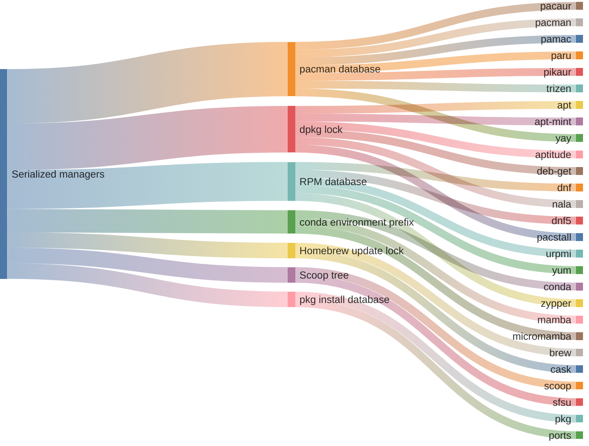

# {octicon}`cpu` Concurrency

Every `mpm` command fans out over the managers it selected and drives them at the same time. That is where most of the speed comes from: an `mpm outdated` on a machine carrying a dozen managers costs about as long as its slowest one, rather than the sum of all twelve.

Two things bound that parallelism: how many managers you let run at once, and the handful that reach a backend some other manager reaches too.

## How many run at once

`--jobs` caps the number of managers running concurrently. It takes a count, or one of two keywords: `auto`, the default, is one fewer than the machine's logical CPU cores, leaving one free for `mpm` itself and for the system; `max` is all of them. `--jobs 1` runs the managers one after another.

Two situations ignore that setting and run sequentially anyway. A batch of one manager has nothing left to parallelize. And `--verbosity DEBUG` streams every manager's raw output line by line, where interleaving a dozen of them would scramble the narration the flag exists to produce.

Before any of that, every command detects which of the managers it selected are installed, by asking each of them for its version. That round is bounded by `--jobs` and takes the same two exceptions, and it is the only work `mpm managers` does: `--jobs` therefore still matters to a command driving no package operation at all.

## What each command spreads

- ⇶⇶⇶ every selected manager runs at once.
- ⇉⇶→ mixed concurrency, where every manager runs at once, except the ones [sharing the same backend](#shared-backends) which runs sequentially.
- →→→ one manager at a time, whatever `--jobs` says.

```{python:render}
:mirror:
from meta_package_manager._docs import concurrency_table

print(concurrency_table())
```

<!-- mirror -->

| Command                        | Concurrency |
| :----------------------------- | :---------: |
| `mpm cleanup`                  |     ⇉⇶→     |
| `mpm doctor`                   |     ⇉⇶→     |
| `mpm dump`                     |     ⇶⇶⇶     |
| `mpm install`                  |     ⇉⇶→     |
| `mpm install <untied package>` |     →→→     |
| `mpm installed`                |     ⇶⇶⇶     |
| `mpm orphans`                  |     ⇶⇶⇶     |
| `mpm outdated`                 |     ⇶⇶⇶     |
| `mpm remove`                   |     ⇉⇶→     |
| `mpm restore`                  |     ⇉⇶→     |
| `mpm sbom`                     |     ⇶⇶⇶     |
| `mpm search`                   |     ⇶⇶⇶     |
| `mpm sync`                     |     ⇉⇶→     |
| `mpm upgrade`                  |     ⇉⇶→     |

<!-- mirror-end -->

Managers run in parallel; a single manager's own packages do not. An `mpm remove pkg-a pkg-b` drives [`brew`](managers/brew.md) and [`cargo`](managers/cargo.md) at the same time, but hands `pkg-a` and `pkg-b` to `brew` one at a time. No package manager is safe to invoke twice at once against its own state.

The one command that parallelizes nothing is an `mpm install` naming a package you left untied to a manager. That install is a priority search: try the managers in order and stop at the first one carrying the package, which cannot be answered by running them all at once. `mpm` notes at `INFO` when an explicit `--jobs` is ignored for this reason. Tie the package to a manager, with `--brew` or with a purl like `pkg:brew/curl`, and the install joins the ⇉⇶→ row above.

The subcommands that drive no package operation of their own are left out of the table: there is nothing for them to spread.

## Shared backends

Two managers are normally independent processes over disjoint state, which is what makes running them together safe. The exception is the group below: each of these drives a backend that another manager in the pool drives too, so the two queue on one lock.

`mpm` never lets two members of the same family mutate at the same time. Each waits for the previous one, even at a higher `--jobs`, while managers outside the family keep running in parallel.

```{python:render}
:mirror:
from meta_package_manager._docs import lock_families_sankey

print(lock_families_sankey())
```

<!-- mirror -->



<!-- mirror-end -->

```{python:render}
:mirror:
from meta_package_manager._docs import lock_families_table

print(lock_families_table())
```

<!-- mirror -->

| Shared backend           | Managers                                                                                                                                                                                                           | Why?                                                                                                                                                         |
| :----------------------- | :----------------------------------------------------------------------------------------------------------------------------------------------------------------------------------------------------------------- | :----------------------------------------------------------------------------------------------------------------------------------------------------------- |
| pacman database          | [`pacaur`](managers/pacaur.md), [`pacman`](managers/pacman.md), [`pamac`](managers/pamac.md), [`paru`](managers/paru.md), [`pikaur`](managers/pikaur.md), [`trizen`](managers/trizen.md), [`yay`](managers/yay.md) | they all reach the pacman database (`/var/lib/pacman/db.lck`), and two of them mutating at once fail to init their transaction                               |
| dpkg lock                | [`apt`](managers/apt.md), [`apt-mint`](managers/apt-mint.md), [`aptitude`](managers/aptitude.md), [`deb-get`](managers/deb-get.md), [`nala`](managers/nala.md), [`pacstall`](managers/pacstall.md)                 | they all install through `dpkg` and serialize on its `/var/lib/dpkg/lock`                                                                                    |
| RPM database             | [`dnf`](managers/dnf.md), [`dnf5`](managers/dnf5.md), [`urpmi`](managers/urpmi.md), [`yum`](managers/yum.md), [`zypper`](managers/zypper.md)                                                                       | they all reach the RPM database                                                                                                                              |
| conda environment prefix | [`conda`](managers/conda.md), [`mamba`](managers/mamba.md), [`micromamba`](managers/micromamba.md)                                                                                                                 | they act on one environment prefix and one package cache, and `conda` honors none of the locks `mamba` takes on them                                         |
| Homebrew update lock     | [`brew`](managers/brew.md), [`cask`](managers/cask.md)                                                                                                                                                             | they are the same `brew` binary, and two concurrent `brew update` collide on Homebrew's own update lock                                                      |
| Scoop tree               | [`scoop`](managers/scoop.md), [`sfsu`](managers/sfsu.md)                                                                                                                                                           | they work on the same `~/scoop` tree, `sfsu` delegating its mutating operations to the `scoop` binary itself                                                 |
| pkg install database     | [`pkg`](managers/pkg.md), [`ports`](managers/ports.md)                                                                                                                                                             | `ports` keeps no registry of its own and registers what it builds through `pkg`, whose advisory lock on that shared install database refuses a second writer |

<!-- mirror-end -->

Every manager the table does not name shares its backend with nothing else `mpm` drives, and always runs in parallel. Each family member repeats its own constraint in the *Concurrency* section of its page, so the fact is one click away from wherever you meet the manager.

## See also

- {doc}`sudo` — why a run that escalates privileges probes the credential cache before fanning out.
- {doc}`managers` — the full pool, one page each.
- {doc}`cli-parameters` — `--jobs` alongside every other global option.
