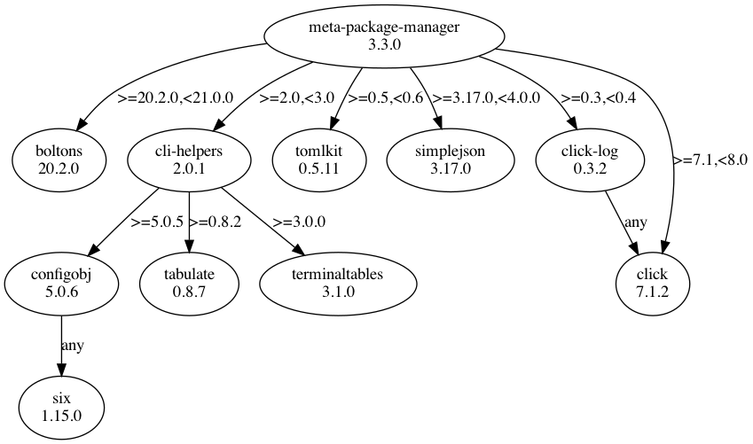

Installation
============

This package is `available on PyPi
<https://pypi.python.org/pypi/meta-package-manager>`_, so you can install the
latest stable release and its dependencies with a simple ``pip`` call:

.. code-block:: shell-session

    $ pip install meta-package-manager

See also `pip installation instructions
<https://pip.pypa.io/en/stable/installing/>`_.

.. warning::

    ``mpm``, `the Python module <https://pypi.python.org/pypi/mpm>`_, is not
    the same as ``meta-package-manager``. Only the later provides the
    :command:`mpm` CLI *per-se*. The former has nothing to do with the
    current project.

Python dependencies
-------------------

FYI, here is a graph of Python package dependencies:

