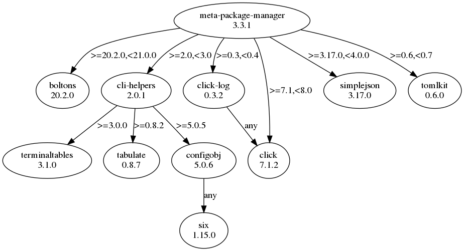

Installation
============

This package is `available on PyPi
<https://pypi.python.org/pypi/meta-package-manager>`_, so you can install the
latest stable release and its dependencies with a simple ``pip`` call:

.. code-block:: shell-session

    $ pip install meta-package-manager

See also `pip installation instructions
<https://pip.pypa.io/en/stable/installing/>`_.

.. warning::

    `*mpm*, the Python module <https://pypi.python.org/pypi/mpm>`_, is not
    the same as ``meta-package-manager``. Only the later provides the
    :command:`mpm` CLI *per-se*. The former has nothing to do with the
    current project.

Shell completion
----------------

Completion for popular shell `rely on Click feature
<https://click.palletsprojects.com/en/7.x/bashcomplete/>`_.

.. tabs::

  .. group-tab:: Bash

    Add this to ``~/.bashrc``:

    .. code-block:: bash

        eval "$(_MPM_COMPLETE=source_bash mpm)"

  .. group-tab:: Zsh

    Add this to ``~/.zshrc``:

    .. code-block:: zsh

        eval "$(_MPM_COMPLETE=source_zsh mpm)"

  .. group-tab:: Fish

    Add this to ``~/.config/fish/completions/mpm.fish``:

    .. code-block:: fish

        eval (env _MPM_COMPLETE=source_fish mpm)

Alternatively, export the generated completion code as a static script to be
executed:

.. tabs::

  .. group-tab:: Bash

    .. code-block:: shell-session

        $ _MPM_COMPLETE=source_bash mpm > mpm-complete.sh

    Then source it from ``~/.bashrc``:

    .. code-block:: bash

       . /path/to/mpm-complete.sh

  .. group-tab:: Zsh

    .. code-block:: shell-session

        $ _MPM_COMPLETE=source_zsh mpm > mpm-complete.sh

    Then source it from ``~/.zshrc``:

    .. code-block:: zsh

       . /path/to/mpm-complete.sh

  .. group-tab:: Fish

    .. code-block:: fish

       _MPM_COMPLETE=source_fish mpm > ~/.config/fish/completions/mpm-comp.fish

Python dependencies
-------------------

FYI, here is a graph of Python package dependencies:

