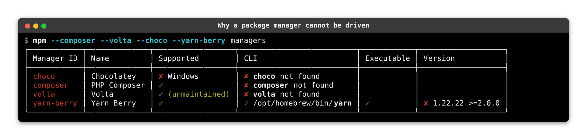

# {octicon}`file-submodule` Package managers

```{python:render}
from meta_package_manager._docs import manager_support_bar

print(manager_support_bar())
```

```{python:render}
from meta_package_manager._docs import manager_support_legend

print(manager_support_legend())
```

```{python:render}
from meta_package_manager._docs import managers_index_table

print(managers_index_table())
```

```{toctree}
:glob:
:hidden:
:maxdepth: 1
managers/*
```

The full reason behind each declined tool lives in [unsupported managers](unsupported.md).

## Detecting managers on your system

`mpm managers` reports the package managers it found on your machine, and the version each one self-reports. If one of yours is missing from that report, name it: a manager you select explicitly is always reported, and the extra columns spell out what `mpm` could not resolve.



Four different reasons, one per row. [`choco`](managers/choco.md) only runs on Windows. [`composer`](managers/composer.md) is supported here but its CLI is nowhere on the `PATH`. [`volta`](managers/volta.md) is missing too, and is flagged unmaintained upstream, which is also why selecting it prints a deprecation notice on `stderr`. And [`yarn-berry`](managers/yarn-berry.md) is the interesting one: its CLI was found and is executable, but the `yarn` on this machine is a `1.x` that does not satisfy the `>=2.0.0` its wrapper requires, so `mpm` will not drive it.

To browse the whole catalog instead, widen the view: `mpm managers --view supported` lists every manager your platform can run, found or not, and `mpm managers --view all` adds those `mpm` implements for other platforms and the unmaintained ones. The global `--all-managers` flag is a synonym for the widest of the three.
