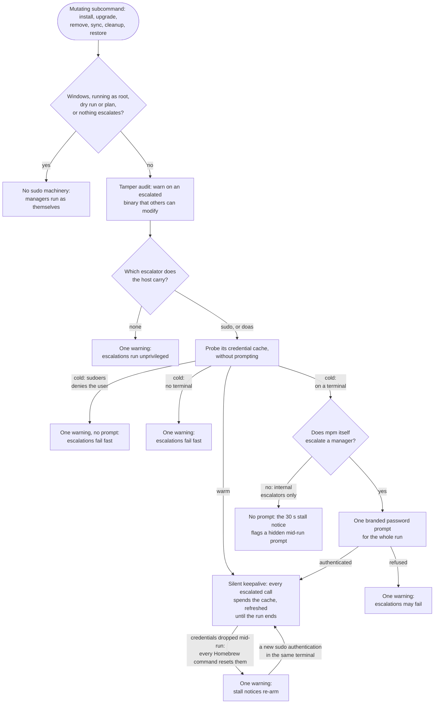

# {octicon}`key` Privilege escalation and `sudo`

Most Linux package managers need `sudo` to perform system-wide operations, and on other OSes you may be prompted for your password to install privileged payloads (a macOS cask shipping a kernel extension or a `.pkg` installer, for example):

```shell-session
$ brew install --cask macfuse
==> Caveats
macfuse requires a kernel extension to work.
If the installation fails, retry after you enable it in:
  System Preferences → Security & Privacy → General

For more information, refer to vendor documentation or this Apple Technical Note:
  https://developer.apple.com/library/content/technotes/tn2459/_index.html

==> Downloading https://github.com/osxfuse/osxfuse/releases/download/macfuse-4.2.5/macfuse-4.2.5.dmg
Already downloaded: /Users/kde/Library/Caches/Homebrew/downloads/d7961d772f16bad95962f1a780b545a5dbb4788ec6e1ec757994bb5296397b1c--macfuse-4.2.5.dmg
==> Installing Cask macfuse
==> Running installer for macfuse; your password may be necessary.
Package installers may write to any location; options such as `--appdir` are ignored.
Password:
```

## Escalation policy

Which managers escalate is decided per manager. System package managers ([`apt`](managers/apt.md), [`dnf`](managers/dnf.md), [`pacman`](managers/pacman.md), [`zypper`](managers/zypper.md), [`xbps`](managers/xbps.md), [`macports`](managers/macports.md), [`snap`](managers/snap.md), and the like) run their state-changing operations through `sudo` by default; user-level managers ([`brew`](managers/brew.md), [`npm`](managers/npm.md), [`pip`](managers/pip.md), ...) do not, and daemon-backed managers authorizing through polkit ([`flatpak`](managers/flatpak.md), [`fwupd`](managers/fwupd.md), [`pkcon`](managers/pkcon.md)) need no wrap at all. A password prompt raised by those last ones comes from polkit, not `sudo`, so a `NOPASSWD` rule does not silence it: grant a polkit rule instead.

## Choosing the escalator

`mpm` drives `sudo` or [`doas`](https://man.openbsd.org/doas), picking whichever the host carries and preferring `sudo` when both are installed. That matters on the systems that ship no `sudo` at all: OpenBSD replaced it with `doas` in its base system, and neither Alpine nor NetBSD carries one by default, while `mpm` wraps escalating managers on all three ([`apk`](managers/apk.md), [`pkg-tools`](managers/pkg-tools.md) and [`pkgin`](managers/pkgin.md) among them).

A `sudo` on `PATH` is checked before it is preferred, because the name does not always belong to sudo. Alpine packages [`doas-sudo-shim`](https://github.com/jirutka/doas-sudo-shim), which installs a `/usr/bin/sudo` script forwarding to `doas` and accepting `--non-interactive` out of everything `mpm` sends: escalation through it works while every credential probe fails on an unknown option, which reads as a cold cache on a host that never asks for a password. So `mpm` runs `sudo --version` first and drives `doas` directly where that does not answer as sudo.

Name one explicitly with `--sudo-command`, or with its `[mpm] sudo_command` config key:

```toml
[mpm]
sudo_command = "doas"
```

This selects the binary only. Whether a manager escalates at all stays the separate decision of `--sudo` / `--no-sudo` and each manager's own policy, described next.

The two are not interchangeable underneath. `doas` takes short options only, so `mpm` escalates through `doas -n` where it would write `sudo --non-interactive`. It also has no way to authenticate without running a command, so the credential probe runs `doas -n true`, and its persistence is opt-in per rule in `doas.conf`: `mpm` therefore never refreshes a `doas` credential on a schedule, where it keeps a `sudo` one alive for the whole run. A host with neither binary gets one warning, and its managers run unprivileged rather than failing on a missing `sudo`.

## Controlling escalation

Override the default globally with `--sudo` / `--no-sudo`, or per manager with the `sudo` key of a [`[mpm.managers.<id>]`](overrides.md) section:

```toml
[mpm]
sudo = false # Same as passing --no-sudo on every run.

[mpm.managers.npm]
sudo = true # Run global npm installs through sudo.

[mpm.managers.pacman]
sudo = false # Rootless setup: never escalate pacman.
```

The global flag has its own `[mpm] sudo` key, so a standing policy needs no flag on the command line.

A per-manager `sudo` value wins over the global flag, so you can escalate everything with `--sudo` while keeping a single manager rootless, or the reverse.

## One prompt, up front

`mpm` [runs managers concurrently](concurrency.md) with their output muted behind a progress bar, so a `sudo` password prompt raised mid-run is easy to miss and can stall the whole command. Before a state-changing command (`install`, `upgrade`, `remove`, `sync`, `cleanup`, `restore`) that involves escalation, `mpm` therefore probes the credential cache without prompting. A cache found warm (a prior `sudo --validate`, a `NOPASSWD` rule, a recent privileged command) is silently kept fresh for the rest of the run, and every escalated call spends it: no prompt at all. While that keepalive runs, the terminal holds live `sudo` credentials, so anyone at the keyboard can interrupt `mpm` and reuse them until they expire: the same exposure as any pre-authenticated `sudo` session, worth knowing before walking away from a long run.

The decision path, from the up-front probe to the end of the run:



Only a cold cache, on an interactive terminal, leads to a prompt: a notice names the managers about to escalate and the subcommand, then a single branded `sudo` prompt authenticates once for the whole run, so nothing blocks in the fan-out:

```shell-session
$ mpm upgrade
apt, deb-get need administrator rights to upgrade.
[mpm] password for kevin (running apt, deb-get):
```

The prompt names the account whose password `sudo` accepts, which is not always the caller. A `targetpw`, `rootpw` or `runaspw` policy asks for a different one, and openSUSE ships `Defaults targetpw`, so the same prompt reads `password for root` there.

Off a terminal (a pipe, CI, a {doc}`desktop menu <desktop-menus>`), `mpm` cannot prompt: a warning names the managers needing root, and they fail fast with a clear error instead of hanging. To escalate unattended, configure a `NOPASSWD` rule for the managers' commands: `mpm` then asks `sudo --list` whether each escalated command is granted without a password, and proceeds silently when they all are. That second question is needed because `sudo --validate` answers a different one: it refuses whenever *any* matching `sudoers` entry wants a password, so a `NOPASSWD` rule reads as a cold cache as soon as a distribution's stock `ALL ALL=(ALL) ALL` sits beside it, which is what openSUSE ships. A prior `sudo --validate` also works, but only from the same terminal session `mpm` runs in: under sudo's default terminal-keyed timestamps, credentials cached in one terminal do not carry to a `mpm` launched without one (a desktop frontend, a CI step), so `NOPASSWD` is the robust choice there.

One tool undoes the priming from inside the run: every Homebrew command [resets the `sudo` timestamp at startup](https://github.com/Homebrew/brew/blob/6bf9a47106220bc907579a9aa7c47faac070ea40/Library/Homebrew/brew.sh#L651-L655), on purpose, so a run mixing [`brew`](managers/brew.md) or [`cask`](managers/cask.md) with escalating managers can lose its credentials mid-flight. `mpm` warns when its background refresh finds them gone, and the managers escalating internally regain their hidden-prompt notice. A `NOPASSWD` rule is immune to the reset.

The probe also reads `sudo`'s answer: a user the `sudoers` policy does not authorize at all gets one warning and no password prompt, since a password could not change the answer.

## Managers escalating internally

Some managers run `sudo` from inside their own commands: on macOS, [`brew`](managers/brew.md) escalates while installing a cask with a privileged payload (the `macfuse` example above) and [`fink`](managers/fink.md) re-execs its root commands through `sudo`, while on Linux the AUR helpers call `sudo pacman` for their privileged phases, [`pacstall`](managers/pacstall.md) re-execs itself through `sudo pacstall`, and [`topgrade`](managers/topgrade.md) drives each privileged step through its own per-step `sudo`. `mpm` never wraps these managers in `sudo` (`brew` even refuses to run as root, and `topgrade` warns and prompts when launched as root), and most of their runs never escalate, so a stock `mpm upgrade` does not pre-authenticate for them: prompting on every run would be worse than the rare mid-run prompt it avoids.

Three mechanisms cover that rare prompt instead. When the up-front probe finds the credential cache already warm, the keepalive is armed for internal escalators too, so their mid-run `sudo` spends the cache silently. On a cold cache, such a manager is held back from the concurrent batch and run last, on its own ([why](concurrency.md#managers-that-escalate-on-their-own)), and its call runs without a spinner. The prompt the tool prints therefore stays on a still terminal, to be answered. A call that then stays silent for 30 seconds draws a warning:

```shell-session
$ mpm install macfuse
(...)
warning:cask: No output for 30s: may be waiting on a hidden password prompt. Last output: "==> Running installer for macfuse; your password may be necessary."
```

For a guaranteed one-prompt experience, opt the manager into up-front authentication with a scoped `sudo = true` override:

```toml
[mpm.managers.cask]
sudo = true # Authenticate up front before any privileged cask payload.
```

or scope the global flag to the manager: `mpm --cask --sudo upgrade`. Prefer these to a bare `mpm --sudo upgrade`, which is broader than it looks: the global flag covers every selected manager, and also activates dormant privileged markers like those of [`pip`](managers/pip.md), [`npm`](managers/npm.md), [`gem`](managers/gem.md) and [`cpan`](managers/cpan.md), wrapping their system-scope installs in `sudo`. Left dormant, those markers still pay off on failure: an operation carrying one that dies on a permission error (a root-owned npm prefix, a system Ruby) draws a warning naming this scoped opt-in, right after the tool's own account of the refusal.

## Running `mpm` itself as root

On Linux you may instead install and run `mpm` under `sudo`, so every manager it drives is already privileged:

```shell-session
$ sudo uv tool install meta-package-manager
(...)
$ sudo mpm upgrade
(...)
```

## Security

Escalating a manager runs its binary, and every install script of the packages it touches, as root. `mpm` only escalates the managers that require it or that you have opted in, and it warns when a `sudo` override is read from an untrusted config source. See [the security model](security.md) for the trust rules behind this.
