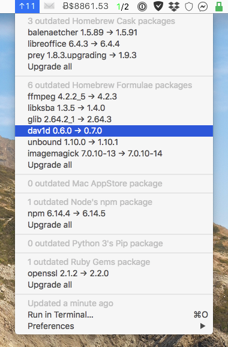

# xbar Plugin

``` {sidebar} Default layout

```

``` {sidebar} Submenu layout

```

A copy of the latest stable version of the xbar plugin for `mpm` is always
[available on xbar
website](https://xbarapp.com/docs/plugins/Dev/meta_package_manager.7h.py.html)
and [plugin
repository](https://github.com/matryer/xbar-plugins/blob/master/Dev/meta_package_manager.7h.py).

## Development constraints

xbar plugins are self-contained scripts. As such, the
`meta_package_manager.7h.py` needs to be able to run without any extra
dependency, on the pre-installed Python distribution that ships with macOS.

xbar itself [requires macOS Catalina or newer (>=
10.15)](https://github.com/matryer/xbar/blame/2d063e0e46a0e427aedef62dc047b0065602cd40/README.md#L9).
The embedded [Python 2.x on this platform is
deprecated](https://developer.apple.com/documentation/macos-release-notes/macos-catalina-10_15-release-notes):

``` shell-session
$ python

WARNING: Python 2.7 is not recommended.
This version is included in macOS for compatibility with legacy software.
Future versions of macOS will not include Python 2.7.
Instead, it is recommended that you transition to using 'python3' from within Terminal.

Python 2.7.16 (default, Aug 24 2019, 18:37:03)
[GCC 4.2.1 Compatible Apple LLVM 11.0.0 (clang-1100.0.32.4) (-macos10.15-objc-s on darwin
Type "help", "copyright", "credits" or "license" for more information.
>>>
```

So this plugin targets Python 3.7.3 or newer, which is the default version
available on Catalina as the `python3` CLI:

``` shell-session
$ xcrun python3
Python 3.7.3 (default, Sep  5 2019, 17:14:41)
[Clang 11.0.0 (clang-1100.0.33.8)] on darwin
```

## Development workflow

Active development of the plugin is happening here, as a side-project of
{command}`mpm` itself.

Releases of the plugin is synchronized with the package. Both share the exact
same version to simplify management. This explain why the plugin could appears
jumpimg ahead of a couple of major/minor version while providing tiny or no
changes at all.

A release is ready when both the package and the plugin reach a stable state.

If the plugin has been changed between releases, a [copy of the plugin is
pushed](https://github.com/matryer/xbar-plugins/pulls?q=is%3Apr%20%22Meta%20Package%20Manager%22)
to the [official xbar plugin
repository](https://github.com/matryer/xbar-plugins/blob/master/Dev/meta_package_manager.7h.py).

## Release process

1.  [Fork](https://help.github.com/articles/fork-a-repo/) the official [xbar
    plugin repository](https://github.com/matryer/xbar-plugins).

2.  Fetch a local copy of the fork:

    ``` shell-session
    $ git clone https://github.com/kdeldycke/xbar-plugins
    $ cd xbar-plugins
    ```

3.  Create a new branch and switch to it:

    ``` shell-session
    $ git branch meta-package-manager-v230
    $ git checkout meta-package-manager-v230
    ```

4.  Replace existing copy of the plugin with the latest tagged version:

    ``` shell-session
    $ wget https://raw.githubusercontent.com/kdeldycke/meta-package-manager/v2.3.0/meta_package_manager/xbar/meta_package_manager.7h.py
    $ mv ./meta_package_manager.7h.py ./Dev/
    $ chmod 755 ./Dev/meta_package_manager.7h.py
    ```

5.  Commit the new plugin:

    ``` shell-session
    $ git add ./Dev/meta_package_manager.7h.py
    $ git commit -m 'Upgrade to Meta Package Manager plugin v2.3.0.'
    ```

6.  Push new branch:

    ``` shell-session
    $ git push --set-upstream origin meta-package-manager-v230
    ```

7.  [Create a
    pull-request](https://help.github.com/articles/creating-a-pull-request/) in
    the original repository.
