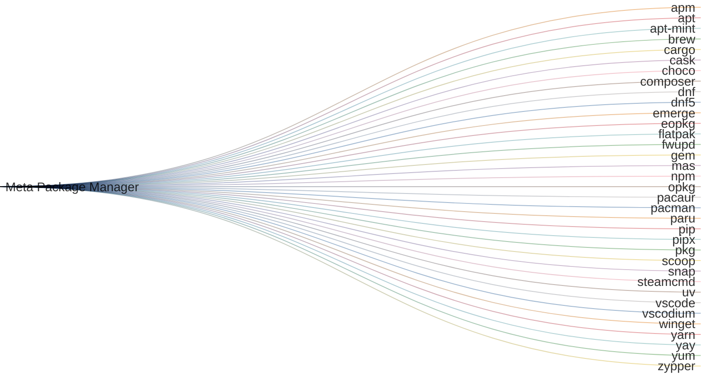

<p align="center">
  <a href="https://github.com/kdeldycke/meta-package-manager/">
    
  </a>
</p>

<a href="https://xkcd.com/1654/" alt="XKCD #1654: Universal Install Script">

</a>

[](https://pypi.org/project/meta-package-manager)
[](https://pypi.org/project/meta-package-manager)
[](https://pepy.tech/projects/meta_package_manager)
[](https://github.com/kdeldycke/meta-package-manager/actions/workflows/tests.yaml?query=branch%3Amain)
[](https://app.codecov.io/gh/kdeldycke/meta-package-manager)
[](https://github.com/kdeldycke/meta-package-manager/actions/workflows/docs.yaml?query=branch%3Amain)
[](https://doi.org/10.5281/zenodo.6809571)

**What is Meta Package Manager?**

- provides the `mpm` CLI, a wrapper around all package managers
- `mpm` is like [`yt-dlp`](https://github.com/yt-dlp/yt-dlp), but for package
  managers instead of videos
- `mpm` solves [XKCD #1654 - *Universal Install Script*](https://xkcd.com/1654/)

---

## Features


- Inventory and list all package managers available on the system.
- Supports macOS, Linux and Windows.
- [Standalone executables](#executables) for Linux, macOS and Windows.
- List installed packages.
- List duplicate installed packages.
- Search for packages.
- Install a package.
- Remove a package.
- List outdated packages.
- Sync local package infos.
- Upgrade all outdated packages.
- Backup list of installed packages to TOML file.
- Restore/install list of packages from TOML files.
- Software Bill of Materials: export installed packages to [SPDX](https://spdx.dev) and [CycloneDX](https://cyclonedx.org) SBOM files.
- Pin-point commands to a subset of package managers (include/exclude
  selectors).
- Support plain, versioned and [purl](https://github.com/package-url/purl-spec) package specifiers.
- Export output to JSON or print user-friendly tables.
- Shell auto-completion for Bash, Zsh and Fish.
- Provides a
  [Xbar/SwiftBar plugin](https://kdeldycke.github.io/meta-package-manager/bar-plugin.html) for
  friendly macOS integration.
- Because `mpm` try to wrap all other package managers, it became another
  pathological case of [XKCD #927: Standards](https://xkcd.com/927/)

## Supported package managers

One CLI to rule them all:

<!-- managers-sankey-start -->



<!-- managers-sankey-end -->

## Metadata and operations

<!-- operation-matrix-start -->

| Package manager                                                                         | Min. version | BSD[^bsd] | Linux[^linux] | macOS | Unix[^unix] | Windows | `installed` | `outdated` | `search` | `install` | `upgrade` | `upgrade_all` | `remove` | `sync` | `cleanup` |
| --------------------------------------------------------------------------------------- | ------------ | :-------: | :-----------: | :---: | :---------: | :-----: | :---------: | :--------: | :------: | :-------: | :-------: | :-----------: | :------: | :----: | :-------: |
| [`apm`](https://atom.io/packages) [⚠️](https://github.blog/2022-06-08-sunsetting-atom/) | 1.0.0        |    🅱️     |      🐧       |  🍎   |             |   🪟    |      ✓      |     ✓      |    ✓     |     ✓     |     ✓     |       ✓       |          |        |           |
| [`apt`](https://wiki.debian.org/AptCLI)                                                 | 1.0.0        |    🅱️     |      🐧       |       |      ⨂      |         |      ✓      |     ✓      |    ✓     |     ✓     |     ✓     |       ✓       |          |   ✓    |     ✓     |
| [`apt-mint`](https://github.com/kdeldycke/meta-package-manager/issues/52)               | 1.0.0        |    🅱️     |      🐧       |       |      ⨂      |         |      ✓      |     ✓      |    ✓     |     ✓     |     ✓     |       ✓       |          |   ✓    |     ✓     |
| [`brew`](https://brew.sh)                                                               | 2.7.0        |           |      🐧       |  🍎   |             |         |      ✓      |     ✓      |    ✓     |     ✓     |     ✓     |       ✓       |    ✓     |   ✓    |     ✓     |
| [`cargo`](https://doc.rust-lang.org/cargo/)                                             | 1.0.0        |    🅱️     |      🐧       |  🍎   |      ⨂      |   🪟    |      ✓      |            |    ✓     |     ✓     |           |               |    ✓     |        |           |
| [`cask`](https://github.com/Homebrew/homebrew-cask)                                     | 2.7.0        |           |               |  🍎   |             |         |      ✓      |     ✓      |    ✓     |     ✓     |     ✓     |       ✓       |    ✓     |   ✓    |     ✓     |
| [`choco`](https://chocolatey.org)                                                       | 2.0.0        |           |               |       |             |   🪟    |      ✓      |     ✓      |    ✓     |     ✓     |     ✓     |       ✓       |          |        |           |
| [`composer`](https://getcomposer.org)                                                   | 1.4.0        |    🅱️     |      🐧       |  🍎   |      ⨂      |   🪟    |      ✓      |     ✓      |    ✓     |     ✓     |     ✓     |       ✓       |          |        |     ✓     |
| [`dnf`](https://github.com/rpm-software-management/dnf)                                 | 4.0.0        |    🅱️     |      🐧       |       |      ⨂      |         |      ✓      |     ✓      |    ✓     |     ✓     |     ✓     |       ✓       |    ✓     |   ✓    |     ✓     |
| [`dnf5`](https://github.com/rpm-software-management/dnf5)                               | 5.0.0        |    🅱️     |      🐧       |       |      ⨂      |         |      ✓      |     ✓      |    ✓     |     ✓     |     ✓     |       ✓       |    ✓     |   ✓    |     ✓     |
| [`emerge`](https://wiki.gentoo.org/wiki/Portage#emerge)                                 | 3.0.0        |    🅱️     |      🐧       |       |      ⨂      |         |      ✓      |     ✓      |    ✓     |     ✓     |     ✓     |       ✓       |          |   ✓    |     ✓     |
| [`eopkg`](https://github.com/getsolus/eopkg/)                                           | 3.2.0        |           |      🐧       |       |             |         |      ✓      |     ✓      |    ✓     |     ✓     |     ✓     |       ✓       |    ✓     |   ✓    |     ✓     |
| [`flatpak`](https://flatpak.org)                                                        | 1.2.0        |    🅱️     |      🐧       |       |      ⨂      |         |      ✓      |     ✓      |    ✓     |     ✓     |     ✓     |       ✓       |          |        |     ✓     |
| [`fwupd`](https://fwupd.org)                                                            | 1.9.5        |           |      🐧       |       |             |         |      ✓      |     ✓      |          |     ✓     |     ✓     |       ✓       |          |   ✓    |           |
| [`gem`](https://rubygems.org)                                                           | 2.5.0        |    🅱️     |      🐧       |  🍎   |      ⨂      |   🪟    |      ✓      |     ✓      |    ✓     |     ✓     |     ✓     |       ✓       |    ✓     |        |     ✓     |
| [`mas`](https://github.com/argon/mas)                                                   | 1.8.7        |           |               |  🍎   |             |         |      ✓      |     ✓      |    ✓     |     ✓     |     ✓     |       ✓       |    ✓     |        |           |
| [`npm`](https://www.npmjs.com)                                                          | 4.0.0        |    🅱️     |      🐧       |  🍎   |      ⨂      |   🪟    |      ✓      |     ✓      |    ✓     |     ✓     |     ✓     |       ✓       |    ✓     |        |           |
| [`opkg`](https://git.yoctoproject.org/cgit/cgit.cgi/opkg/)                              | 0.2.0        |    🅱️     |      🐧       |       |      ⨂      |         |      ✓      |     ✓      |    ✓     |     ✓     |     ✓     |       ✓       |          |   ✓    |           |
| [`pacaur`](https://github.com/E5ten/pacaur)                                             | 4.0.0        |    🅱️     |      🐧       |       |      ⨂      |         |      ✓      |     ✓      |    ✓     |     ✓     |     ✓     |       ✓       |    ✓     |   ✓    |     ✓     |
| [`pacman`](https://wiki.archlinux.org/title/pacman)                                     | 5.0.0        |    🅱️     |      🐧       |       |      ⨂      |         |      ✓      |     ✓      |    ✓     |     ✓     |     ✓     |       ✓       |    ✓     |   ✓    |     ✓     |
| [`paru`](https://github.com/Morganamilo/paru)                                           | 1.9.3        |    🅱️     |      🐧       |       |      ⨂      |         |      ✓      |     ✓      |    ✓     |     ✓     |     ✓     |       ✓       |    ✓     |   ✓    |     ✓     |
| [`pip`](https://pip.pypa.io)                                                            | 10.0.0       |    🅱️     |      🐧       |  🍎   |      ⨂      |   🪟    |      ✓      |     ✓      |          |     ✓     |     ✓     |       ✓       |    ✓     |        |           |
| [`pipx`](https://pipx.pypa.io)                                                          | 1.0.0        |    🅱️     |      🐧       |  🍎   |      ⨂      |   🪟    |      ✓      |     ✓      |          |     ✓     |     ✓     |       ✓       |    ✓     |        |           |
| [`pkg`](https://github.com/freebsd/pkg)                                                 | 1.11         |    🅱️     |      🐧       |  🍎   |      ⨂      |         |      ✓      |     ✓      |    ✓     |     ✓     |     ✓     |       ✓       |    ✓     |   ✓    |     ✓     |
| [`scoop`](https://scoop.sh)                                                             | 0.2.4        |           |               |       |             |   🪟    |      ✓      |     ✓      |    ✓     |     ✓     |     ✓     |       ✓       |    ✓     |   ✓    |     ✓     |
| [`snap`](https://snapcraft.io)                                                          | 2.0.0        |    🅱️     |      🐧       |       |      ⨂      |         |      ✓      |     ✓      |    ✓     |     ✓     |     ✓     |       ✓       |          |        |           |
| [`steamcmd`](https://developer.valvesoftware.com/wiki/SteamCMD)                         | None         |    🅱️     |      🐧       |  🍎   |      ⨂      |   🪟    |             |            |          |     ✓     |           |               |          |        |           |
| [`uv`](https://docs.astral.sh/uv)                                                       | 0.5.0        |    🅱️     |      🐧       |  🍎   |      ⨂      |   🪟    |      ✓      |     ✓      |          |     ✓     |     ✓     |       ✓       |    ✓     |        |     ✓     |
| [`vscode`](https://code.visualstudio.com)                                               | 1.60.0       |    🅱️     |      🐧       |  🍎   |      ⨂      |   🪟    |      ✓      |            |          |     ✓     |           |               |    ✓     |        |           |
| [`vscodium`](https://vscodium.com)                                                      | 1.60.0       |    🅱️     |      🐧       |  🍎   |      ⨂      |   🪟    |      ✓      |            |          |     ✓     |           |               |    ✓     |        |           |
| [`winget`](https://github.com/microsoft/winget-cli)                                     | 1.7          |           |               |       |             |   🪟    |      ✓      |     ✓      |    ✓     |     ✓     |     ✓     |       ✓       |    ✓     |        |           |
| [`yarn`](https://yarnpkg.com)                                                           | 1.20.0       |    🅱️     |      🐧       |  🍎   |      ⨂      |   🪟    |      ✓      |     ✓      |    ✓     |     ✓     |     ✓     |       ✓       |    ✓     |        |     ✓     |
| [`yay`](https://github.com/Jguer/yay)                                                   | 11.0.0       |    🅱️     |      🐧       |       |      ⨂      |         |      ✓      |     ✓      |    ✓     |     ✓     |     ✓     |       ✓       |    ✓     |   ✓    |     ✓     |
| [`yum`](http://yum.baseurl.org)                                                         | 4.0.0        |    🅱️     |      🐧       |       |      ⨂      |         |      ✓      |     ✓      |    ✓     |     ✓     |     ✓     |       ✓       |    ✓     |   ✓    |     ✓     |
| [`zypper`](https://en.opensuse.org/Portal:Zypper)                                       | 1.14.0       |    🅱️     |      🐧       |       |      ⨂      |         |      ✓      |     ✓      |    ✓     |     ✓     |     ✓     |       ✓       |          |   ✓    |     ✓     |

<!-- operation-matrix-end -->

> [!NOTE]
> Missing manager
> If your favorite manager is missing or does not support an operation, you can influence its implementation: [open a ticket to document its output](https://github.com/kdeldycke/meta-package-manager/issues/new?assignees=&labels=%F0%9F%8E%81+feature+request&template=new-package-manager.yaml) or [read the contribution guide](https://kdeldycke.github.io/meta-package-manager/contributing.html) and submit a pull request.
>
> You can help if you [purchase business support 🤝](https://github.com/sponsors/kdeldycke) or [sponsor the project 🫶](https://github.com/sponsors/kdeldycke).

## Installation

All [installation methods](https://kdeldycke.github.io/meta-package-manager/install.html) are available in the documentation. Below are the most popular ones:

### Try it now

[`uv`](https://docs.astral.sh/uv/getting-started/installation/) is the fastest way to run `mpm` on any platform, thanks to its [`uvx` command](https://docs.astral.sh/uv/guides/tools/#running-tools):

```shell-session
$ uvx --from meta-package-manager -- mpm
```

### macOS

`mpm` is part of the official [Homebrew](https://brew.sh) default tap, so you can install it with:

```shell-session
$ brew install meta-package-manager
```

### Windows

`mpm` is available in the `main` repository of [Scoop](https://scoop.sh), so you just need to:

```pwsh-session
> scoop install main/meta-package-manager
```

### Executables

Standalone binaries of `mpm`'s latest version are available as direct downloads for several platforms and architectures:

| Platform    | `arm64`                                                                                                                              | `x86_64`                                                                                                                         |
| ----------- | ------------------------------------------------------------------------------------------------------------------------------------ | -------------------------------------------------------------------------------------------------------------------------------- |
| **Linux**   | [Download `mpm-linux-arm64.bin`](https://github.com/kdeldycke/meta-package-manager/releases/latest/download/mpm-linux-arm64.bin)     | [Download `mpm-linux-x64.bin`](https://github.com/kdeldycke/meta-package-manager/releases/latest/download/mpm-linux-x64.bin)     |
| **macOS**   | [Download `mpm-macos-arm64.bin`](https://github.com/kdeldycke/meta-package-manager/releases/latest/download/mpm-macos-arm64.bin)     | [Download `mpm-macos-x64.bin`](https://github.com/kdeldycke/meta-package-manager/releases/latest/download/mpm-macos-x64.bin)     |
| **Windows** | [Download `mpm-windows-arm64.exe`](https://github.com/kdeldycke/meta-package-manager/releases/latest/download/mpm-windows-arm64.exe) | [Download `mpm-windows-x64.exe`](https://github.com/kdeldycke/meta-package-manager/releases/latest/download/mpm-windows-x64.exe) |

## Quickstart

### List installed packages

List all packages installed on current system:

```shell-session
$ mpm installed
╭─────────────────────────────┬─────────────────────────────┬─────────┬────────────────────╮
│ Package name                │ ID                          │ Manager │ Installed version  │
├─────────────────────────────┼─────────────────────────────┼─────────┼────────────────────┤
│ github                      │ github                      │ apm     │ 0.36.9             │
│ update-package-dependencies │ update-package-dependencies │ apm     │ 0.13.1             │
│ rust                        │ rust                        │ brew    │ 1.55.0             │
│ x264                        │ x264                        │ brew    │ r3060              │
│ atom                        │ atom                        │ cask    │ 1.58.0             │
│ visual-studio-code          │ visual-studio-code          │ cask    │ 1.52.0             │
│ nokogiri                    │ nokogiri                    │ gem     │ x86_64-darwin      │
│ rake                        │ rake                        │ gem     │ 13.0.3             │
│ iMovie                      │ 408981434                   │ mas     │ 10.2.5             │
│ Telegram                    │ 747648890                   │ mas     │ 8.1                │
│ npm                         │ npm                         │ npm     │ 7.24.0             │
│ raven                       │ raven                       │ npm     │ 2.6.4              │
│ jupyterlab                  │ jupyterlab                  │ pip     │ 3.1.14             │
│ Sphinx                      │ Sphinx                      │ pip     │ 4.2.0              │
│ ms-python.python            │ ms-python.python            │ vscode  │ 2021.10.1317843341 │
│ ms-toolsai.jupyter          │ ms-toolsai.jupyter          │ vscode  │ 2021.9.1001312534  │
╰─────────────────────────────┴─────────────────────────────┴─────────┴────────────────────╯
16 packages total (brew: 2, pip: 2, apm: 2, gem: 2, cask: 2, mas: 2, vscode: 2, npm: 2, composer: 0).
```

### List outdated packages

List all packages installed for which an upgrade is available:

```shell-session
$ mpm outdated
╭──────────────┬─────────────┬─────────┬───────────────────┬────────────────╮
│ Package name │ ID          │ Manager │ Installed version │ Latest version │
├──────────────┼─────────────┼─────────┼───────────────────┼────────────────┤
│ curl         │ curl        │ brew    │ 7.79.1            │ 7.79.1_1       │
│ git          │ git         │ brew    │ 2.33.0            │ 2.33.0_1       │
│ openssl@1.1  │ openssl@1.1 │ brew    │ 1.1.1l            │ 1.1.1l_1       │
│ rake         │ rake        │ gem     │ 13.0.3            │ 13.0.6         │
│ Telegram     │ 747648890   │ mas     │ 8.1               │ 8.1.3          │
│ npm          │ npm@8.0.0   │ npm     │ 7.24.0            │ 8.0.0          │
│ pip          │ pip         │ pip     │ 21.2.4            │ 21.3           │
│ regex        │ regex       │ pip     │ 2021.9.30         │ 2021.10.8      │
╰──────────────┴─────────────┴─────────┴───────────────────┴────────────────╯
8 packages total (brew: 3, pip: 2, gem: 1, mas: 1, npm: 1, apm: 0, cask: 0, composer: 0).
```

### List managers

If you wonder why your package manager doesn't seems to be identified, you can list all those recognized by `mpm` with:

```shell-session
$ mpm --all-managers managers
╭────────────┬────────────────────┬────────────────┬──────────────────────────────┬────────────┬───────────╮
│ Manager ID │ Name               │ Supported      │ CLI                          │ Executable │ Version   │
├────────────┼────────────────────┼────────────────┼──────────────────────────────┼────────────┼───────────┤
│ apm        │ Atom's apm         │ ✓              │ ✘ apm not found              │            │           │
│ apt        │ APT                │ ✘ Linux only   │ ✓ /usr/bin/apt               │ ✓          │ ✘         │
│ apt-mint   │ Linux Mint's apt   │ ✘ Linux only   │ ✓ /usr/bin/apt               │ ✓          │ ✘         │
│ brew       │ Homebrew Formulae  │ ✓              │ ✓ /opt/homebrew/bin/brew     │ ✓          │ ✓ 3.6.3   │
│ cargo      │ Rust's cargo       │ ✓              │ ✓ /opt/homebrew/bin/cargo    │ ✓          │ ✓ 1.64.0  │
│ cask       │ Homebrew Cask      │ ✓              │ ✓ /opt/homebrew/bin/brew     │ ✓          │ ✓ 3.6.3   │
│ choco      │ Chocolatey         │ ✘ Windows only │ ✘ choco not found            │            │           │
│ composer   │ PHP's Composer     │ ✓              │ ✓ /opt/homebrew/bin/composer │ ✓          │ ✓ 2.4.2   │
│ dnf        │ DNF                │ ✘ Linux only   │ ✘ dnf not found              │            │           │
│ emerge     │ Emerge             │ ✘ Linux only   │ ✘ emerge not found           │            │           │
│ flatpak    │ Flatpak            │ ✘ Linux only   │ ✘ flatpak not found          │            │           │
│ gem        │ Ruby Gems          │ ✓              │ ✓ /usr/bin/gem               │ ✓          │ ✓ 3.0.3.1 │
│ mas        │ Mac AppStore       │ ✓              │ ✓ /opt/homebrew/bin/mas      │ ✓          │ ✓ 1.8.6   │
│ npm        │ Node's npm         │ ✓              │ ✓ /opt/homebrew/bin/npm      │ ✓          │ ✓ 8.19.2  │
│ opkg       │ OPKG               │ ✘ Linux only   │ ✘ opkg not found             │            │           │
│ pacman     │ Pacman             │ ✘ Linux only   │ ✘ pacman not found           │            │           │
│ paru       │ Paru               │ ✘ Linux only   │ ✘ paru not found             │            │           │
│ pip        │ Pip                │ ✓              │ ✓ ~/.pyenv/shims/python3     │ ✓          │ ✓ 22.2.2  │
│ pipx       │ Pipx               │ ✓              │ ✓ /opt/homebrew/bin/pipx     │ ✓          │ ✓ 1.1.0   │
│ scoop      │ Scoop              │ ✘ Windows only │ ✘ scoop not found            │            │           │
│ snap       │ Snap               │ ✘ Linux only   │ ✘ snap not found             │            │           │
│ steamcmd   │ Valve Steam        │ ✓              │ ✘ steamcmd not found         │            │           │
│ vscode     │ Visual Studio Code │ ✓              │ ✓ /opt/homebrew/bin/code     │ ✓          │ ✓ 1.71.2  │
│ yarn       │ Node's yarn        │ ✓              │ ✓ /opt/homebrew/bin/yarn     │ ✓          │ ✓ 1.22.19 │
│ yay        │ Yay                │ ✘ Linux only   │ ✘ yay not found              │            │           │
│ yum        │ YUM                │ ✘ Linux only   │ ✘ yum not found              │            │           │
│ zypper     │ Zypper             │ ✘ Linux only   │ ✘ zypper not found           │            │           │
╰────────────┴────────────────────┴────────────────┴──────────────────────────────┴────────────┴───────────╯
```

If your favorite manager is not supported yet, you can help! See the [contribution guide](https://kdeldycke.github.io/meta-package-manager/contributing.html).

## Usage

Other subcommands and options are documented in:

- the
  [detailed help screens](https://kdeldycke.github.io/meta-package-manager/cli-parameters.html)
- the
  [list of use-cases](https://kdeldycke.github.io/meta-package-manager/usecase.html)
  where you’ll find inspiration on how to leverage `mpm` power

<!-- operation-footnotes-start -->

[^bsd]: BSD: FreeBSD, MidnightBSD, NetBSD, OpenBSD, SunOS.

[^linux]: Linux: ALT Linux, Amazon Linux, Android, Arch Linux, Buildroot, CachyOS, CentOS, CloudLinux OS, Debian, Exherbo Linux, Fedora, Gentoo Linux, Guix System, IBM PowerKVM, KVM for IBM z Systems, Linux Mint, Mageia, Mandriva Linux, Nobara, openSUSE, openSUSE Tumbleweed, Oracle Linux, Parallels, Pidora, Raspbian, RedHat Enterprise Linux, Rocky Linux, Scientific Linux, Slackware, SUSE Linux Enterprise Server, Tuxedo OS, Ubuntu, Ultramarine, Unknown Linux, Windows Subsystem for Linux v1, Windows Subsystem for Linux v2, XenServer.

[^unix]: Unix: Cygwin, GNU/Hurd, IBM AIX, Solaris.<!-- operation-footnotes-end -->
