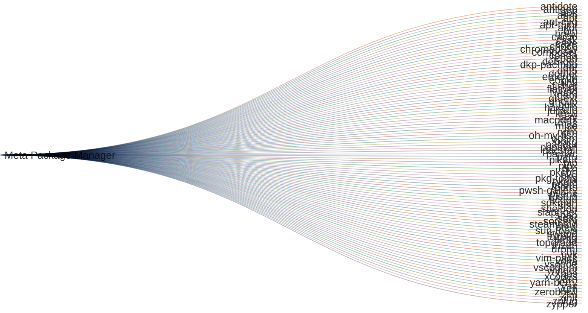

<p align="center">
  <a href="https://github.com/kdeldycke/meta-package-manager/">
    <picture>
      <source media="(prefers-color-scheme: dark)" srcset="https://raw.githubusercontent.com/kdeldycke/meta-package-manager/main/docs/assets/logo-banner-dark.png">
      <source media="(prefers-color-scheme: light)" srcset="https://raw.githubusercontent.com/kdeldycke/meta-package-manager/main/docs/assets/logo-banner-light.png">
      
    </picture>
  </a>
</p>

<a href="https://xkcd.com/1654/" alt="XKCD #1654: Universal Install Script">

</a>

[](https://pypi.org/project/meta-package-manager)
[](https://pypi.org/project/meta-package-manager)
[](https://pepy.tech/projects/meta_package_manager)
[](https://github.com/kdeldycke/meta-package-manager/actions/workflows/tests.yaml?query=branch%3Amain)
[](https://github.com/kdeldycke/meta-package-manager/actions/workflows/docs.yaml?query=branch%3Amain)
[](https://doi.org/10.5281/zenodo.6809571)

**What is Meta Package Manager?**

- provides the `mpm` CLI, a wrapper around all package managers
- `mpm` is like [`yt-dlp`](https://github.com/yt-dlp/yt-dlp), but for package managers instead of videos
- `mpm` solves [XKCD #1654 - *Universal Install Script*](https://xkcd.com/1654/)

---

## Quick start

Thanks to [`uv`](https://docs.astral.sh/uv/getting-started/installation/), you can run `mpm` on any platform in one command, without installation or venv:

```shell-session
$ uvx meta-package-manager
```

## Features


- Inventory and list all [package managers](https://mpm.run/cli-parameters.html#mpm-managers) available on the system.
- Supports macOS, Linux and Windows.
- [Standalone executables](#executables) for Linux, macOS and Windows.
- [List installed packages](https://mpm.run/cli-parameters.html#mpm-installed).
- [List duplicate installed packages](https://mpm.run/duplicates.html).
- [Search for packages](https://mpm.run/cli-parameters.html#mpm-search).
- [Install a package](https://mpm.run/cli-parameters.html#mpm-install).
- [Remove a package](https://mpm.run/cli-parameters.html#mpm-remove).
- [List outdated packages](https://mpm.run/cli-parameters.html#mpm-outdated).
- [List orphaned packages](https://mpm.run/cli-parameters.html#mpm-orphans).
- [Sync local package infos](https://mpm.run/cli-parameters.html#mpm-sync).
- [Diagnose the health of package managers](https://mpm.run/cli-parameters.html#mpm-doctor).
- [Upgrade all outdated packages](https://mpm.run/cli-parameters.html#mpm-upgrade).
- [Mitigate supply-chain attacks](https://mpm.run/cooldown.html) with a release-age cooldown that refuses too-recent versions: `mpm --cooldown "7 days" upgrade --all`.
- [Snapshot installed packages](https://mpm.run/cli-parameters.html#mpm-dump) to a TOML manifest or a Brewfile.
- [Restore/install list of packages](https://mpm.run/cli-parameters.html#mpm-restore) from TOML files.
- [Software Bill of Materials](https://mpm.run/cli-parameters.html#mpm-sbom): export installed packages to [SPDX](https://spdx.dev) and [CycloneDX](https://cyclonedx.org) SBOM files.
- Pin-point commands to a [subset of package managers](https://mpm.run/configuration.html#selecting-managers) (include/exclude selectors).
- Support plain, versioned and [purl](https://github.com/package-url/purl-spec) package specifiers.
- Export output to [JSON or user-friendly tables](https://mpm.run/cli-parameters.html#mpm).
- [Shell auto-completion](https://mpm.run/install.html) for Bash, Zsh and Fish.
- Provides a [Xbar/SwiftBar plugin](https://mpm.run/bar-plugin.html) for
  friendly macOS integration.
- Provides a [GNOME Shell extension](https://mpm.run/gnome-shell.html) for
  friendly Linux desktop integration.
- Because `mpm` tries to wrap all other package managers, it became another pathological case of [XKCD #927: Standards](https://xkcd.com/927/)

## Supported package managers

One CLI to rule them all:

<!-- mirror-src
from meta_package_manager._docs import managers_sankey

print(managers_sankey())
-->


```mermaid
---
config: {"sankey": {"showValues": false, "width": 800, "height": 400}}
---
sankey-beta

Meta Package Manager,antidote,1
Meta Package Manager,antigen,1
Meta Package Manager,apk,1
Meta Package Manager,apm,1
Meta Package Manager,apt,1
Meta Package Manager,apt-cyg,1
Meta Package Manager,apt-mint,1
Meta Package Manager,asdf,1
Meta Package Manager,bin,1
Meta Package Manager,brew,1
Meta Package Manager,cargo,1
Meta Package Manager,cask,1
Meta Package Manager,cave,1
Meta Package Manager,choco,1
Meta Package Manager,chromebrew,1
Meta Package Manager,composer,1
Meta Package Manager,conda,1
Meta Package Manager,cpan,1
Meta Package Manager,deb-get,1
Meta Package Manager,dkp-pacman,1
Meta Package Manager,dnf,1
Meta Package Manager,dnf5,1
Meta Package Manager,dotnet,1
Meta Package Manager,emerge,1
Meta Package Manager,eopkg,1
Meta Package Manager,fink,1
Meta Package Manager,fisher,1
Meta Package Manager,flatpak,1
Meta Package Manager,fwupd,1
Meta Package Manager,gem,1
Meta Package Manager,gh-ext,1
Meta Package Manager,ghcup,1
Meta Package Manager,guix,1
Meta Package Manager,haxelib,1
Meta Package Manager,juliaup,1
Meta Package Manager,krew,1
Meta Package Manager,lazy,1
Meta Package Manager,macports,1
Meta Package Manager,mas,1
Meta Package Manager,mise,1
Meta Package Manager,nix,1
Meta Package Manager,npm,1
Meta Package Manager,oh-my-fish,1
Meta Package Manager,opam,1
Meta Package Manager,opkg,1
Meta Package Manager,pacaur,1
Meta Package Manager,pacman,1
Meta Package Manager,pacstall,1
Meta Package Manager,pamac,1
Meta Package Manager,paru,1
Meta Package Manager,pikaur,1
Meta Package Manager,pip,1
Meta Package Manager,pipx,1
Meta Package Manager,pixi,1
Meta Package Manager,pkcon,1
Meta Package Manager,pkg,1
Meta Package Manager,pkg-tools,1
Meta Package Manager,pkgin,1
Meta Package Manager,pnpm,1
Meta Package Manager,ports,1
Meta Package Manager,pwsh-gallery,1
Meta Package Manager,pyenv,1
Meta Package Manager,rustup,1
Meta Package Manager,scoop,1
Meta Package Manager,sdkman,1
Meta Package Manager,sfsu,1
Meta Package Manager,sheldon,1
Meta Package Manager,slapt-get,1
Meta Package Manager,snap,1
Meta Package Manager,soar,1
Meta Package Manager,sorcery,1
Meta Package Manager,steamcmd,1
Meta Package Manager,stew,1
Meta Package Manager,sun-tools,1
Meta Package Manager,swupd,1
Meta Package Manager,tazpkg,1
Meta Package Manager,tlmgr,1
Meta Package Manager,topgrade,1
Meta Package Manager,trizen,1
Meta Package Manager,urpmi,1
Meta Package Manager,uv,1
Meta Package Manager,uvx,1
Meta Package Manager,vim-pack,1
Meta Package Manager,volta,1
Meta Package Manager,vscode,1
Meta Package Manager,vscodium,1
Meta Package Manager,winget,1
Meta Package Manager,xbps,1
Meta Package Manager,xcodes,1
Meta Package Manager,yarn,1
Meta Package Manager,yarn-berry,1
Meta Package Manager,yay,1
Meta Package Manager,yum,1
Meta Package Manager,zerobrew,1
Meta Package Manager,zim,1
Meta Package Manager,zinit,1
Meta Package Manager,zplug,1
Meta Package Manager,zypper,1
```

<!-- mirror-src-end -->

## Metadata and operations

<!-- mirror-src
from meta_package_manager._docs import operation_matrix

print(operation_matrix()[0])
-->

| Package manager                                                                                | Version      | Cooldown |   Platforms   | `installed` | `outdated` | `orphans` | `search` | `install` | `upgrade` | `upgrade_all` | `remove` | `sync` | `cleanup` | `doctor` |
| :--------------------------------------------------------------------------------------------- | :----------- | :------: | :-----------: | :---------: | :--------: | :-------: | :------: | :-------: | :-------: | :-----------: | :------: | :----: | :-------: | :------: |
| [`antidote`](https://mpm.run/managers/antidote.html)                                           | >= 2.2       |          |     🐧 🍎     |      ✓      |     ✓      |           |          |     ✓     |           |       ✓       |    ✓     |        |           |          |
| [`antigen`](https://mpm.run/managers/antigen.html)                                             | >= 2         |          |     🐧 🍎     |      ✓      |            |           |          |           |           |       ✓       |    ✓     |        |           |          |
| [`apk`](https://mpm.run/managers/apk.html)                                                     | >= 2.10      |          |      🐧       |      ✓      |     ✓      |           |    ✓     |     ✓     |     ✓     |       ✓       |    ✓     |   ✓    |     ✓     |          |
| [`apm`](https://mpm.run/managers/apm.html) [⚠️](https://mpm.run/managers/apm.html)             | >= 1         |          |  🅱️ 🐧 🍎 🪟  |      ✓      |     ✓      |           |    ✓     |     ✓     |     ✓     |       ✓       |    ✓     |        |     ✓     |          |
| [`apt`](https://mpm.run/managers/apt.html)                                                     | >= 1         |          |    🅱️ 🐧 ⨂    |      ✓      |     ✓      |     ✓     |    ✓     |     ✓     |     ✓     |       ✓       |    ✓     |   ✓    |     ✓     |    ✓     |
| [`apt-cyg`](https://mpm.run/managers/apt-cyg.html) [⚠️](https://mpm.run/managers/apt-cyg.html) |              |          |               |      ✓      |            |           |    ✓     |     ✓     |           |               |    ✓     |   ✓    |           |          |
| [`apt-mint`](https://mpm.run/managers/apt-mint.html)                                           | >= 1         |          |    🅱️ 🐧 ⨂    |      ✓      |     ✓      |     ✓     |    ✓     |     ✓     |     ✓     |       ✓       |    ✓     |   ✓    |     ✓     |    ✓     |
| [`asdf`](https://mpm.run/managers/asdf.html)                                                   | >= 0.16      |          |     🐧 🍎     |      ✓      |     ✓      |           |    ✓     |     ✓     |     ✓     |       ✓       |    ✓     |   ✓    |           |          |
| [`bin`](https://mpm.run/managers/bin.html)                                                     | >= 0.27      |          |   🐧 🍎 🪟    |      ✓      |            |           |          |           |     ✓     |       ✓       |    ✓     |        |           |          |
| [`brew`](https://mpm.run/managers/brew.html)                                                   | >= 6         |          |     🐧 🍎     |      ✓      |     ✓      |     ✓     |    ✓     |     ✓     |     ✓     |       ✓       |    ✓     |   ✓    |     ✓     |    ✓     |
| [`cargo`](https://mpm.run/managers/cargo.html)                                                 | >= 1         |          | 🅱️ 🐧 🍎 ⨂ 🪟 |      ✓      |            |           |    ✓     |     ✓     |           |               |    ✓     |        |           |          |
| [`cask`](https://mpm.run/managers/cask.html)                                                   | >= 6         |          |      🍎       |      ✓      |     ✓      |           |    ✓     |     ✓     |     ✓     |       ✓       |    ✓     |   ✓    |     ✓     |    ✓     |
| [`cave`](https://mpm.run/managers/cave.html)                                                   |              |          |               |      ✓      |            |     ✓     |          |     ✓     |     ✓     |       ✓       |    ✓     |   ✓    |     ✓     |          |
| [`choco`](https://mpm.run/managers/choco.html)                                                 | >= 2         |          |      🪟       |      ✓      |     ✓      |           |    ✓     |     ✓     |     ✓     |       ✓       |    ✓     |        |           |          |
| [`chromebrew`](https://mpm.run/managers/chromebrew.html)                                       |              |          |               |      ✓      |            |           |    ✓     |     ✓     |     ✓     |       ✓       |    ✓     |   ✓    |           |          |
| [`composer`](https://mpm.run/managers/composer.html)                                           | >= 1.4       |          | 🅱️ 🐧 🍎 ⨂ 🪟 |      ✓      |     ✓      |           |    ✓     |     ✓     |     ✓     |       ✓       |    ✓     |        |     ✓     |    ✓     |
| [`conda`](https://mpm.run/managers/conda.html)                                                 | >= 4.6       |          |   🐧 🍎 🪟    |      ✓      |     ✓      |           |    ✓     |     ✓     |     ✓     |       ✓       |    ✓     |        |     ✓     |          |
| [`cpan`](https://mpm.run/managers/cpan.html)                                                   | >= 1.64      |          | 🅱️ 🐧 🍎 ⨂ 🪟 |      ✓      |     ✓      |           |          |     ✓     |     ✓     |       ✓       |          |        |           |          |
| [`deb-get`](https://mpm.run/managers/deb-get.html)                                             |              |          |      🐧       |      ✓      |     ✓      |           |    ✓     |     ✓     |     ✓     |       ✓       |    ✓     |   ✓    |     ✓     |          |
| [`dkp-pacman`](https://mpm.run/managers/dkp-pacman.html)                                       | >= 6         |          |     🐧 🍎     |      ✓      |     ✓      |     ✓     |    ✓     |     ✓     |     ✓     |       ✓       |    ✓     |   ✓    |     ✓     |    ✓     |
| [`dnf`](https://mpm.run/managers/dnf.html)                                                     | >= 4         |          |    🅱️ 🐧 ⨂    |      ✓      |     ✓      |     ✓     |    ✓     |     ✓     |     ✓     |       ✓       |    ✓     |   ✓    |     ✓     |    ✓     |
| [`dnf5`](https://mpm.run/managers/dnf5.html)                                                   | >= 5         |          |    🅱️ 🐧 ⨂    |      ✓      |     ✓      |     ✓     |    ✓     |     ✓     |     ✓     |       ✓       |    ✓     |   ✓    |     ✓     |    ✓     |
| [`dotnet`](https://mpm.run/managers/dotnet.html)                                               | >= 8.0.400   |          |   🐧 🍎 🪟    |      ✓      |            |           |    ✓     |     ✓     |     ✓     |       ✓       |    ✓     |        |           |          |
| [`emerge`](https://mpm.run/managers/emerge.html)                                               | >= 3         |          |    🅱️ 🐧 ⨂    |      ✓      |     ✓      |     ✓     |    ✓     |     ✓     |     ✓     |       ✓       |    ✓     |   ✓    |     ✓     |          |
| [`eopkg`](https://mpm.run/managers/eopkg.html)                                                 | >= 3.2       |          |      🐧       |      ✓      |     ✓      |           |    ✓     |     ✓     |     ✓     |       ✓       |    ✓     |   ✓    |     ✓     |          |
| [`fink`](https://mpm.run/managers/fink.html)                                                   |              |          |      🍎       |      ✓      |            |           |    ✓     |     ✓     |     ✓     |       ✓       |    ✓     |   ✓    |     ✓     |          |
| [`fisher`](https://mpm.run/managers/fisher.html)                                               | >= 4         |          |     🐧 🍎     |      ✓      |            |           |          |     ✓     |     ✓     |       ✓       |    ✓     |        |           |          |
| [`flatpak`](https://mpm.run/managers/flatpak.html)                                             | >= 1.2       |          |    🅱️ 🐧 ⨂    |      ✓      |     ✓      |           |    ✓     |     ✓     |     ✓     |       ✓       |    ✓     |        |     ✓     |    ✓     |
| [`fwupd`](https://mpm.run/managers/fwupd.html)                                                 | >= 1.9.5     |          |      🐧       |      ✓      |     ✓      |           |          |     ✓     |     ✓     |       ✓       |          |   ✓    |           |          |
| [`gem`](https://mpm.run/managers/gem.html)                                                     | >= 2.5       |          | 🅱️ 🐧 🍎 ⨂ 🪟 |      ✓      |     ✓      |           |    ✓     |     ✓     |     ✓     |       ✓       |    ✓     |   ✓    |     ✓     |    ✓     |
| [`gh-ext`](https://mpm.run/managers/gh-ext.html)                                               | >= 2         |          |   🐧 🍎 🪟    |      ✓      |            |           |    ✓     |     ✓     |     ✓     |       ✓       |    ✓     |        |           |          |
| [`ghcup`](https://mpm.run/managers/ghcup.html)                                                 | >= 0.2.1     |          |   🐧 🍎 🪟    |      ✓      |            |           |    ✓     |     ✓     |           |               |    ✓     |   ✓    |     ✓     |          |
| [`guix`](https://mpm.run/managers/guix.html)                                                   |              |          |      🐧       |      ✓      |     ✓      |           |    ✓     |     ✓     |     ✓     |       ✓       |    ✓     |   ✓    |     ✓     |          |
| [`haxelib`](https://mpm.run/managers/haxelib.html)                                             | >= 4         |          | 🅱️ 🐧 🍎 ⨂ 🪟 |      ✓      |            |           |    ✓     |     ✓     |     ✓     |       ✓       |    ✓     |        |           |          |
| [`juliaup`](https://mpm.run/managers/juliaup.html)                                             | >= 1.21      |          |   🐧 🍎 🪟    |      ✓      |     ✓      |           |    ✓     |     ✓     |     ✓     |       ✓       |    ✓     |        |     ✓     |          |
| [`krew`](https://mpm.run/managers/krew.html)                                                   | >= 0.4       |          | 🅱️ 🐧 🍎 ⨂ 🪟 |      ✓      |            |           |    ✓     |     ✓     |     ✓     |       ✓       |    ✓     |   ✓    |           |          |
| [`lazy`](https://mpm.run/managers/lazy.html)                                                   | >= 11        |          | 🅱️ 🐧 🍎 ⨂ 🪟 |      ✓      |            |           |          |           |           |       ✓       |          |        |           |          |
| [`macports`](https://mpm.run/managers/macports.html)                                           | >= 2         |          |      🍎       |      ✓      |     ✓      |           |    ✓     |     ✓     |     ✓     |       ✓       |    ✓     |   ✓    |     ✓     |    ✓     |
| [`mas`](https://mpm.run/managers/mas.html)                                                     | >= 7         |          |      🍎       |      ✓      |     ✓      |           |    ✓     |     ✓     |     ✓     |       ✓       |    ✓     |        |           |          |
| [`mise`](https://mpm.run/managers/mise.html)                                                   | >= 2025.5.10 |          | 🅱️ 🐧 🍎 ⨂ 🪟 |      ✓      |     ✓      |           |    ✓     |     ✓     |     ✓     |       ✓       |    ✓     |   ✓    |     ✓     |    ✓     |
| [`nix`](https://mpm.run/managers/nix.html)                                                     | >= 2         |          |     🐧 🍎     |      ✓      |     ✓      |           |    ✓     |     ✓     |     ✓     |       ✓       |    ✓     |   ✓    |     ✓     |          |
| [`npm`](https://mpm.run/managers/npm.html)                                                     | >= 11.10     |    ✓     | 🅱️ 🐧 🍎 ⨂ 🪟 |      ✓      |     ✓      |           |    ✓     |     ✓     |     ✓     |       ✓       |    ✓     |        |     ✓     |    ✓     |
| [`oh-my-fish`](https://mpm.run/managers/oh-my-fish.html)                                       | >= 6         |          |     🐧 🍎     |      ✓      |            |           |          |     ✓     |     ✓     |       ✓       |    ✓     |        |           |          |
| [`opam`](https://mpm.run/managers/opam.html)                                                   | >= 2         |          |   🅱️ 🐧 🍎    |      ✓      |            |           |    ✓     |     ✓     |     ✓     |       ✓       |    ✓     |   ✓    |           |          |
| [`opkg`](https://mpm.run/managers/opkg.html)                                                   | >= 0.2       |          |    🅱️ 🐧 ⨂    |      ✓      |     ✓      |           |    ✓     |     ✓     |     ✓     |       ✓       |    ✓     |   ✓    |           |          |
| [`pacaur`](https://mpm.run/managers/pacaur.html) [⚠️](https://mpm.run/managers/pacaur.html)    | >= 4         |          |    🅱️ 🐧 ⨂    |      ✓      |     ✓      |     ✓     |    ✓     |     ✓     |     ✓     |       ✓       |    ✓     |   ✓    |     ✓     |    ✓     |
| [`pacman`](https://mpm.run/managers/pacman.html)                                               | >= 5         |          |    🅱️ 🐧 ⨂    |      ✓      |     ✓      |     ✓     |    ✓     |     ✓     |     ✓     |       ✓       |    ✓     |   ✓    |     ✓     |    ✓     |
| [`pacstall`](https://mpm.run/managers/pacstall.html)                                           | >= 6         |          |      🐧       |      ✓      |     ✓      |           |    ✓     |     ✓     |     ✓     |       ✓       |    ✓     |   ✓    |           |          |
| [`pamac`](https://mpm.run/managers/pamac.html)                                                 | >= 11        |          |               |      ✓      |     ✓      |     ✓     |    ✓     |     ✓     |     ✓     |       ✓       |    ✓     |        |     ✓     |          |
| [`paru`](https://mpm.run/managers/paru.html)                                                   | >= 1.9.3     |          |    🅱️ 🐧 ⨂    |      ✓      |     ✓      |     ✓     |    ✓     |     ✓     |     ✓     |       ✓       |    ✓     |   ✓    |     ✓     |    ✓     |
| [`pikaur`](https://mpm.run/managers/pikaur.html)                                               | >= 1         |          |    🅱️ 🐧 ⨂    |      ✓      |     ✓      |     ✓     |    ✓     |     ✓     |     ✓     |       ✓       |    ✓     |   ✓    |     ✓     |    ✓     |
| [`pip`](https://mpm.run/managers/pip.html)                                                     | >= 26.1      |    ✓     | 🅱️ 🐧 🍎 ⨂ 🪟 |      ✓      |     ✓      |           |          |     ✓     |     ✓     |       ✓       |    ✓     |        |     ✓     |    ✓     |
| [`pipx`](https://mpm.run/managers/pipx.html)                                                   | >= 1         |    ✓     | 🅱️ 🐧 🍎 ⨂ 🪟 |      ✓      |     ✓      |           |          |     ✓     |     ✓     |       ✓       |    ✓     |        |           |          |
| [`pixi`](https://mpm.run/managers/pixi.html)                                                   | >= 0.65      |          |   🐧 🍎 🪟    |      ✓      |            |           |          |     ✓     |     ✓     |       ✓       |    ✓     |        |     ✓     |          |
| [`pkcon`](https://mpm.run/managers/pkcon.html)                                                 | >= 0.7       |          |               |      ✓      |     ✓      |           |    ✓     |     ✓     |     ✓     |       ✓       |    ✓     |   ✓    |           |          |
| [`pkg`](https://mpm.run/managers/pkg.html)                                                     | >= 1.11      |          |               |      ✓      |     ✓      |     ✓     |    ✓     |     ✓     |     ✓     |       ✓       |    ✓     |   ✓    |     ✓     |    ✓     |
| [`pkg-tools`](https://mpm.run/managers/pkg-tools.html)                                         |              |          |               |      ✓      |            |     ✓     |    ✓     |     ✓     |     ✓     |       ✓       |    ✓     |        |     ✓     |          |
| [`pkgin`](https://mpm.run/managers/pkgin.html)                                                 |              |          |               |      ✓      |     ✓      |           |    ✓     |     ✓     |     ✓     |       ✓       |    ✓     |   ✓    |     ✓     |          |
| [`pnpm`](https://mpm.run/managers/pnpm.html)                                                   | >= 11        |    ✓     | 🅱️ 🐧 🍎 ⨂ 🪟 |      ✓      |     ✓      |           |    ✓     |     ✓     |     ✓     |       ✓       |    ✓     |        |     ✓     |          |
| [`ports`](https://mpm.run/managers/ports.html)                                                 |              |          |               |      ✓      |     ✓      |           |          |     ✓     |     ✓     |       ✓       |    ✓     |   ✓    |     ✓     |          |
| [`pwsh-gallery`](https://mpm.run/managers/pwsh-gallery.html)                                   | >= 7.4       |          |   🐧 🍎 🪟    |      ✓      |     ✓      |           |    ✓     |     ✓     |     ✓     |       ✓       |    ✓     |        |           |          |
| [`pyenv`](https://mpm.run/managers/pyenv.html)                                                 | >= 2.3.13    |          |     🐧 🍎     |      ✓      |            |           |    ✓     |     ✓     |           |               |    ✓     |        |           |          |
| [`rustup`](https://mpm.run/managers/rustup.html)                                               | >= 1.28      |          |   🐧 🍎 🪟    |      ✓      |     ✓      |           |          |     ✓     |     ✓     |       ✓       |    ✓     |        |           |          |
| [`scoop`](https://mpm.run/managers/scoop.html)                                                 | >= 0.2.4     |          |      🪟       |      ✓      |     ✓      |           |    ✓     |     ✓     |     ✓     |       ✓       |    ✓     |   ✓    |     ✓     |    ✓     |
| [`sdkman`](https://mpm.run/managers/sdkman.html)                                               | >= 5         |          |     🐧 🍎     |      ✓      |     ✓      |           |          |     ✓     |     ✓     |       ✓       |    ✓     |   ✓    |     ✓     |          |
| [`sfsu`](https://mpm.run/managers/sfsu.html)                                                   | >= 1.16      |          |      🪟       |      ✓      |     ✓      |           |    ✓     |     ✓     |     ✓     |       ✓       |    ✓     |   ✓    |     ✓     |          |
| [`sheldon`](https://mpm.run/managers/sheldon.html)                                             | >= 0.6       |          |     🐧 🍎     |             |            |           |          |           |           |       ✓       |    ✓     |        |           |          |
| [`slapt-get`](https://mpm.run/managers/slapt-get.html)                                         |              |          |               |      ✓      |            |           |    ✓     |     ✓     |     ✓     |       ✓       |    ✓     |   ✓    |     ✓     |          |
| [`snap`](https://mpm.run/managers/snap.html)                                                   | >= 2         |          |    🅱️ 🐧 ⨂    |      ✓      |     ✓      |           |    ✓     |     ✓     |     ✓     |       ✓       |    ✓     |        |           |          |
| [`soar`](https://mpm.run/managers/soar.html)                                                   | >= 0.12      |          |      🐧       |      ✓      |            |           |    ✓     |     ✓     |     ✓     |       ✓       |    ✓     |   ✓    |     ✓     |          |
| [`sorcery`](https://mpm.run/managers/sorcery.html)                                             |              |          |               |      ✓      |            |           |    ✓     |     ✓     |     ✓     |       ✓       |    ✓     |   ✓    |     ✓     |          |
| [`steamcmd`](https://mpm.run/managers/steamcmd.html)                                           |              |          | 🅱️ 🐧 🍎 ⨂ 🪟 |             |            |           |          |     ✓     |           |               |          |        |           |          |
| [`stew`](https://mpm.run/managers/stew.html)                                                   | >= 0.3       |          |   🐧 🍎 🪟    |      ✓      |            |           |          |     ✓     |     ✓     |       ✓       |    ✓     |        |           |          |
| [`sun-tools`](https://mpm.run/managers/sun-tools.html)                                         |              |          |               |      ✓      |            |           |          |           |           |               |    ✓     |        |           |          |
| [`swupd`](https://mpm.run/managers/swupd.html) [⚠️](https://mpm.run/managers/swupd.html)       |              |          |               |      ✓      |            |           |    ✓     |     ✓     |           |       ✓       |    ✓     |        |     ✓     |          |
| [`tazpkg`](https://mpm.run/managers/tazpkg.html)                                               |              |          |               |      ✓      |            |           |    ✓     |     ✓     |     ✓     |       ✓       |    ✓     |   ✓    |     ✓     |          |
| [`tlmgr`](https://mpm.run/managers/tlmgr.html)                                                 | >= 2018      |          | 🅱️ 🐧 🍎 ⨂ 🪟 |      ✓      |     ✓      |           |    ✓     |     ✓     |     ✓     |       ✓       |    ✓     |   ✓    |     ✓     |    ✓     |
| [`topgrade`](https://mpm.run/managers/topgrade.html)                                           | >= 17        |          |  🅱️ 🐧 🍎 🪟  |             |            |           |          |           |           |       ✓       |          |        |           |          |
| [`trizen`](https://mpm.run/managers/trizen.html)                                               | >= 1         |          |    🅱️ 🐧 ⨂    |      ✓      |     ✓      |     ✓     |    ✓     |     ✓     |     ✓     |       ✓       |    ✓     |   ✓    |     ✓     |    ✓     |
| [`urpmi`](https://mpm.run/managers/urpmi.html)                                                 |              |          |               |      ✓      |     ✓      |           |    ✓     |     ✓     |     ✓     |       ✓       |    ✓     |   ✓    |     ✓     |          |
| [`uv`](https://mpm.run/managers/uv.html)                                                       | >= 0.5       |    ✓     | 🅱️ 🐧 🍎 ⨂ 🪟 |      ✓      |     ✓      |           |          |     ✓     |     ✓     |       ✓       |    ✓     |        |     ✓     |          |
| [`uvx`](https://mpm.run/managers/uvx.html)                                                     | >= 0.10.10   |    ✓     | 🅱️ 🐧 🍎 ⨂ 🪟 |      ✓      |     ✓      |           |          |     ✓     |     ✓     |       ✓       |    ✓     |        |           |          |
| [`vim-pack`](https://mpm.run/managers/vim-pack.html)                                           | >= 0.12      |          | 🅱️ 🐧 🍎 ⨂ 🪟 |      ✓      |            |           |          |     ✓     |     ✓     |       ✓       |    ✓     |        |           |          |
| [`volta`](https://mpm.run/managers/volta.html) [⚠️](https://mpm.run/managers/volta.html)       | >= 1.0.2     |          |   🐧 🍎 🪟    |      ✓      |            |           |          |     ✓     |     ✓     |               |    ✓     |        |           |          |
| [`vscode`](https://mpm.run/managers/vscode.html)                                               | >= 1.60      |          | 🅱️ 🐧 🍎 ⨂ 🪟 |      ✓      |            |           |          |     ✓     |           |               |    ✓     |        |           |          |
| [`vscodium`](https://mpm.run/managers/vscodium.html)                                           | >= 1.60      |          | 🅱️ 🐧 🍎 ⨂ 🪟 |      ✓      |            |           |          |     ✓     |           |               |    ✓     |        |           |          |
| [`winget`](https://mpm.run/managers/winget.html)                                               | >= 1.28.190  |          |      🪟       |      ✓      |     ✓      |           |    ✓     |     ✓     |     ✓     |       ✓       |    ✓     |   ✓    |           |          |
| [`xbps`](https://mpm.run/managers/xbps.html)                                                   | >= 0.59      |          |      🐧       |      ✓      |     ✓      |     ✓     |    ✓     |     ✓     |     ✓     |       ✓       |    ✓     |   ✓    |     ✓     |    ✓     |
| [`xcodes`](https://mpm.run/managers/xcodes.html)                                               | >= 1         |          |      🍎       |      ✓      |            |           |          |           |           |               |    ✓     |   ✓    |           |          |
| [`yarn`](https://mpm.run/managers/yarn.html)                                                   | >= 1.20, < 2 |          | 🅱️ 🐧 🍎 ⨂ 🪟 |      ✓      |     ✓      |           |    ✓     |     ✓     |     ✓     |       ✓       |    ✓     |        |     ✓     |          |
| [`yarn-berry`](https://mpm.run/managers/yarn-berry.html)                                       | >= 2         |          | 🅱️ 🐧 🍎 ⨂ 🪟 |             |            |           |    ✓     |           |           |               |          |        |     ✓     |          |
| [`yay`](https://mpm.run/managers/yay.html)                                                     | >= 11        |    ✓     |    🅱️ 🐧 ⨂    |      ✓      |     ✓      |     ✓     |    ✓     |     ✓     |     ✓     |       ✓       |    ✓     |   ✓    |     ✓     |    ✓     |
| [`yum`](https://mpm.run/managers/yum.html)                                                     | >= 4         |          |    🅱️ 🐧 ⨂    |      ✓      |     ✓      |     ✓     |    ✓     |     ✓     |     ✓     |       ✓       |    ✓     |   ✓    |     ✓     |    ✓     |
| [`zerobrew`](https://mpm.run/managers/zerobrew.html)                                           | >= 0.3       |          |     🐧 🍎     |      ✓      |     ✓      |           |          |     ✓     |     ✓     |       ✓       |    ✓     |        |           |          |
| [`zim`](https://mpm.run/managers/zim.html)                                                     | >= 1         |          |     🐧 🍎     |      ✓      |            |           |          |           |           |       ✓       |          |        |           |          |
| [`zinit`](https://mpm.run/managers/zinit.html)                                                 | >= 3.10      |          |     🐧 🍎     |      ✓      |            |           |          |     ✓     |     ✓     |       ✓       |    ✓     |        |           |          |
| [`zplug`](https://mpm.run/managers/zplug.html)                                                 | >= 2         |          |     🐧 🍎     |      ✓      |            |           |          |           |     ✓     |       ✓       |          |        |           |          |
| [`zypper`](https://mpm.run/managers/zypper.html)                                               | >= 1.14      |          |    🅱️ 🐧 ⨂    |      ✓      |     ✓      |     ✓     |    ✓     |     ✓     |     ✓     |       ✓       |    ✓     |   ✓    |     ✓     |          |

Platforms: 🅱️ BSD[^bsd] · 🐧 Linux[^linux] · 🍎 macOS · ⨂ Unix[^unix] · 🪟 Windows

<!-- mirror-src-end -->

> [!NOTE]
> If your favorite manager is missing or does not support an operation, you can influence its implementation: [open a ticket to document its output](https://github.com/kdeldycke/meta-package-manager/issues/new?assignees=&labels=%F0%9F%8E%81+feature+request&template=new-package-manager.yaml) or [read the contribution guide](https://mpm.run/contributing.html) and submit a pull request.
>
> You can help if you [purchase business support 🤝](https://github.com/sponsors/kdeldycke) or [sponsor the project 🫶](https://github.com/sponsors/kdeldycke).

## Installation

All [installation methods](https://mpm.run/install.html) are available in the documentation. Below are the most popular ones:

### macOS

`mpm` is part of the official [Homebrew](https://brew.sh) default tap, so you can install it with:

```shell-session
$ brew install meta-package-manager
```

It is also [available on MacPorts](https://ports.macports.org/port/meta-package-manager/):

```shell-session
$ sudo port install meta-package-manager
```

### Windows

`mpm` is available in the `main` repository of [Scoop](https://scoop.sh), so you just need to:

```pwsh-session
> scoop install main/meta-package-manager
```

### Executables

Standalone binaries of `mpm` latest version are available as direct downloads for several platforms and architectures:

| Platform    | `arm64`                                                                                                                                                                | `x86_64`                                                                                                                                                           |
| ----------- | ---------------------------------------------------------------------------------------------------------------------------------------------------------------------- | ------------------------------------------------------------------------------------------------------------------------------------------------------------------ |
| **Linux**   | [Download `meta-package-manager-linux-arm64.bin`](https://github.com/kdeldycke/meta-package-manager/releases/latest/download/meta-package-manager-linux-arm64.bin)     | [Download `meta-package-manager-linux-x64.bin`](https://github.com/kdeldycke/meta-package-manager/releases/latest/download/meta-package-manager-linux-x64.bin)     |
| **macOS**   | [Download `meta-package-manager-macos-arm64.bin`](https://github.com/kdeldycke/meta-package-manager/releases/latest/download/meta-package-manager-macos-arm64.bin)     | [Download `meta-package-manager-macos-x64.bin`](https://github.com/kdeldycke/meta-package-manager/releases/latest/download/meta-package-manager-macos-x64.bin)     |
| **Windows** | [Download `meta-package-manager-windows-arm64.exe`](https://github.com/kdeldycke/meta-package-manager/releases/latest/download/meta-package-manager-windows-arm64.exe) | [Download `meta-package-manager-windows-x64.exe`](https://github.com/kdeldycke/meta-package-manager/releases/latest/download/meta-package-manager-windows-x64.exe) |

No need to install Python or `uv`. Useful for CI/CD pipelines running on minimal images, or old platforms where dependency management is painful.

## Quickstart

### List installed packages

List all packages installed on current system:

```shell-session
$ mpm installed
╭──────────────────────────────────────────────┬─────────┬──────────┬──────────────────────────────────────────╮
│ Package ID                                   │ Name    │ Manager  │ Installed version                        │
├──────────────────────────────────────────────┼─────────┼──────────┼──────────────────────────────────────────┤
│ curl                                         │         │ brew     │ 8.21.0                                   │
│ git                                          │         │ brew     │ 2.55.0                                   │
│ aerial                                       │         │ cask     │ 3.6.3                                    │
│ amethyst                                     │         │ cask     │ 0.24.3                                   │
│ bigdecimal                                   │         │ gem      │ 3.1.4                                    │
│ bundler                                      │         │ gem      │ 2.4.22                                   │
│ 361285480                                    │ Keynote │ mas      │ 15.3.1                                   │
│ 408981434                                    │ iMovie  │ mas      │ 10.4.4                                   │
│ @mermaid-js/mermaid-cli                      │         │ npm      │ 11.12.0                                  │
│ npm                                          │         │ npm      │ 11.19.0                                  │
│ cyclonedx-python-lib                         │         │ uv       │ 11.11.0                                  │
│ packageurl-python                            │         │ uv       │ 0.17.6                                   │
│ https://github.com/nvim-lualine/lualine.nvim │         │ vim-pack │ 221ce6b2d999187044529f49da6554a92f740a96 │
│ charliermarsh.ruff                           │         │ vscode   │ 2026.70.0                                │
│ ms-python.python                             │         │ vscode   │ 2026.4.0                                 │
│ zsh-users/zsh-autosuggestions                │         │ zinit    │ ?                                        │
│ zsh-users/zsh-completions                    │         │ zinit    │ ?                                        │
│ (...)                                        │         │          │                                          │
╰──────────────────────────────────────────────┴─────────┴──────────┴──────────────────────────────────────────╯
483 packages total (brew: 246, uv: 75, gem: 62, cask: 52, vscode: 16, vim-pack: 9, zinit: 9, mas: 7, npm: 6, cargo: 1, gh-ext: 0, pnpm: 0, uvx: 0, yarn: 0).
```

Narrow the listing to packages whose ID or name matches a query by passing it as an argument. The match is fuzzy by default (case-insensitive and tokenized); add `--exact` to require a verbatim match on the package ID or name:

```shell-session
$ mpm installed sphinx
$ mpm installed --exact Sphinx
```

### List outdated packages

List all packages installed for which an upgrade is available:

```shell-session
$ mpm outdated
╭──────────────┬─────────────┬─────────┬───────────────────┬────────────────╮
│ Package name │ ID          │ Manager │ Installed version │ Latest version │
├──────────────┼─────────────┼─────────┼───────────────────┼────────────────┤
│ curl         │ curl        │ brew    │ 7.79.1            │ 7.79.1_1       │
│ git          │ git         │ brew    │ 2.33.0            │ 2.33.0_1       │
│ openssl@1.1  │ openssl@1.1 │ brew    │ 1.1.1l            │ 1.1.1l_1       │
│ rake         │ rake        │ gem     │ 13.0.3            │ 13.0.6         │
│ Telegram     │ 747648890   │ mas     │ 8.1               │ 8.1.3          │
│ npm          │ npm@8.0.0   │ npm     │ 7.24.0            │ 8.0.0          │
│ pip          │ pip         │ pip     │ 21.2.4            │ 21.3           │
│ regex        │ regex       │ pip     │ 2021.9.30         │ 2021.10.8      │
╰──────────────┴─────────────┴─────────┴───────────────────┴────────────────╯
8 packages total (brew: 3, pip: 2, gem: 1, mas: 1, npm: 1, apm: 0, cask: 0, composer: 0).
```

The same query argument restricts the listing to outdated packages whose ID or name matches, again fuzzy by default and exact with `--exact`:

```shell-session
$ mpm outdated git
```

### Upgrade outdated packages

[A recent study shows that 70% of vulnerabilities lie in outdated libraries](https://developers.slashdot.org/story/20/05/23/2330244/open-source-security-report-finds-library-induced-flaws-in-70-of-applications), so keeping every piece of software up to date is one of the key habits of security professionals. `mpm` upgrades all packages from all managers with a one-liner:

```shell-session
$ mpm upgrade --all
Updating all outdated packages from brew...
==> Upgrading 4 outdated packages:
gnu-getopt 2.35.1 -> 2.35.2
rclone 1.51.0 -> 1.52.0
fd 8.1.0 -> 8.1.1
youtube-dl 2020.05.08 -> 2020.05.29
(...)
Updating all outdated packages from cask...
==> Upgrading 4 outdated packages:
balenaetcher 1.5.89 -> 1.5.94, libreoffice 6.4.3 -> 6.4.4
(...)
Updating all outdated packages from gem...
Updating openssl
(...)
Updating all outdated packages from npm...
+ npm@6.14.5
(...)
Updating all outdated packages from pip...
Successfully installed dephell-argparse-0.1.3
Successfully installed dephell-pythons-0.1.15
```

This is the primary use case of `mpm`, and the main reason I built it.

### Upgrade with a supply-chain cooldown

There is a counter-argument to the advice above. Chasing the newest release the moment it ships is exactly how supply-chain attacks reach you: a compromised version is usually detected and pulled within days of publication, but an immediate upgrade installs it before that happens. Blindly staying on the bleeding edge trades one risk (outdated, vulnerable libraries) for another (freshly poisoned releases).

`mpm` reconciles the two with a release-age cooldown, refusing any version published more recently than a threshold:

```shell-session
$ mpm --cooldown "7 days" upgrade --all
```

You still pick up older security fixes promptly, while sitting out the risky first days of a brand-new release. See [the cooldown guide](https://mpm.run/cooldown.html) for the full mechanism and which managers enforce it natively.

### List managers

If you wonder why your package manager doesn't seem to be identified, you can list all those recognized by `mpm` on the current platform:

```shell-session
$ mpm managers
╭──────────────┬───────────────────────┬───────────┬────────────────────────────────────────────────────────────────────────┬────────────┬─────────────────────╮
│ Manager ID   │ Name                  │ Supported │ CLI                                                                    │ Executable │ Version             │
├──────────────┼───────────────────────┼───────────┼────────────────────────────────────────────────────────────────────────┼────────────┼─────────────────────┤
│ asdf         │ asdf                  │ ✓         │ ✘ asdf not found                                                       │            │                     │
│ brew         │ Homebrew Formulae     │ ✓         │ ✓ /opt/homebrew/bin/brew                                               │ ✓          │ ✓ 6.0.16-2-g007333f │
│ cargo        │ Rust cargo            │ ✓         │ ✓ /opt/homebrew/bin/cargo                                              │ ✓          │ ✓ 1.97.1            │
│ cask         │ Homebrew Cask         │ ✓         │ ✓ /opt/homebrew/bin/brew                                               │ ✓          │ ✓ 6.0.16-2-g007333f │
│ composer     │ PHP Composer          │ ✓         │ ✘ composer not found                                                   │            │                     │
│ conda        │ Conda                 │ ✓         │ ✘ conda not found                                                      │            │                     │
│ cpan         │ Perl CPAN             │ ✓         │ ✓ /usr/bin/cpan                                                        │ ✓          │ ✓ 2.28              │
│ fink         │ Fink                  │ ✓         │ ✘ fink not found                                                       │            │                     │
│ gem          │ RubyGems              │ ✓         │ ✓ /usr/bin/gem                                                         │ ✓          │ ✓ 3.4.5             │
│ gh-ext       │ GitHub CLI extensions │ ✓         │ ✓ /opt/homebrew/bin/gh                                                 │ ✓          │ ✓ 2.97.0            │
│ macports     │ MacPorts              │ ✓         │ ✘ port not found                                                       │            │                     │
│ mas          │ Mac App Store         │ ✓         │ ✓ /opt/homebrew/bin/mas                                                │ ✓          │ ✓ 7.0.0             │
│ mise         │ mise                  │ ✓         │ ✘ mise not found                                                       │            │                     │
│ nix          │ Nix                   │ ✓         │ ✘ nix-env not found                                                    │            │                     │
│ npm          │ Node npm              │ ✓         │ ✓ /opt/homebrew/bin/npm                                                │ ✓          │ ✓ 11.19.0           │
│ pip          │ Python pip            │ ✓         │ ✓ /Users/kde/code/meta-package-manager/.venv/bin/python3               │ ✓          │ ✘                   │
│ pipx         │ Python pipx           │ ✓         │ ✘ pipx not found                                                       │            │                     │
│ pnpm         │ Node pnpm             │ ✓         │ ✓ /opt/homebrew/bin/pnpm                                               │ ✓          │ ✓ 11.20.0           │
│ pwsh-gallery │ PowerShell Gallery    │ ✓         │ ✘ pwsh not found                                                       │            │                     │
│ sdkman       │ SDKMAN                │ ✓         │ ✘ sdkman-init.sh not found                                             │            │                     │
│ steamcmd     │ Valve SteamCMD        │ ✓         │ ✘ steamcmd not found                                                   │            │                     │
│ stew         │ stew                  │ ✓         │ ✘ stew not found                                                       │            │                     │
│ tlmgr        │ TeX Live Manager      │ ✓         │ ✘ tlmgr not found                                                      │            │                     │
│ topgrade     │ Topgrade              │ ✓         │ ✓ /opt/homebrew/bin/topgrade                                           │ ✓          │ ✓ 17.9.0            │
│ uv           │ Python uv             │ ✓         │ ✓ /opt/homebrew/bin/uv                                                 │ ✓          │ ✓ 0.12.3            │
│ uvx          │ Python uvx            │ ✓         │ ✓ /opt/homebrew/bin/uv                                                 │ ✓          │ ✓ 0.12.3            │
│ vim-pack     │ Neovim vim-pack       │ ✓         │ ✓ /opt/homebrew/bin/nvim                                               │ ✓          │ ✓ 0.12.4            │
│ vscode       │ Visual Studio Code    │ ✓         │ ✓ /Applications/Visual Studio Code.app/Contents/Resources/app/bin/code │ ✓          │ ✓ 1.132.0           │
│ vscodium     │ VSCodium              │ ✓         │ ✘ codium not found                                                     │            │                     │
│ yarn         │ Yarn Classic          │ ✓         │ ✓ /opt/homebrew/bin/yarn                                               │ ✓          │ ✓ 1.22.22           │
│ yarn-berry   │ Yarn Berry            │ ✓         │ ✓ /opt/homebrew/bin/yarn                                               │ ✓          │ ✘ 1.22.22 >=2.0.0   │
│ zerobrew     │ zerobrew              │ ✓         │ ✘ zb not found                                                         │            │                     │
│ zinit        │ Zinit                 │ ✓         │ ✓ /opt/homebrew/bin/zsh                                                │ ✓          │ ✓ 3.15.0            │
╰──────────────┴───────────────────────┴───────────┴────────────────────────────────────────────────────────────────────────┴────────────┴─────────────────────╯
```

Unmaintained managers sit out of this default selection, and managers tied to other platforms are hidden: pass `--all-managers` to widen the table to every manager `mpm` knows.

If your favorite manager is not supported yet, you can help! See the [contribution guide](https://mpm.run/contributing.html). A handful of tools are deliberately left out, each with its rationale: they are catalogued in [unsupported managers](https://mpm.run/unsupported.html).

## Used in

Check these projects to get real-life examples of `mpm` usage:

-  [Dotfiles](https://github.com/kdeldycke/dotfiles) - macOS dotfiles for Python developers, using `mpm` to manage system packages.

Feel free to send a PR to add your project in this list if you are relying on `mpm` in any way.

## Usage

Other subcommands and options are documented in:

- the [detailed help screens](https://mpm.run/cli-parameters.html)
- the [manager augmentations](https://mpm.run/augmentations.html) where you’ll find inspiration on how to leverage `mpm` power

<!-- operation-footnotes-start -->

[^bsd]: BSD: DragonFly BSD, FreeBSD, MidnightBSD, NetBSD, OpenBSD, SunOS.

[^linux]: Linux: AlmaLinux, Alpine Linux, ALT Linux, Amazon Linux, Android, Arch Linux, Buildroot, CachyOS, CentOS, ChromeOS, Clear Linux OS, CloudLinux OS, Debian, EndeavourOS, Exherbo Linux, Fedora, Generic Linux, Gentoo Linux, Guix System, IBM PowerKVM, Kali Linux, KVM for IBM z Systems, Linux Mint, Mageia, Mandriva Linux, Manjaro Linux, NixOS, Nobara, openSUSE, OpenWrt, Oracle Linux, Parallels, Pidora, PikaOS, Raspbian, RedHat Enterprise Linux, Rocky Linux, Scientific Linux, Slackware, SliTaz GNU/Linux, Source Mage GNU/Linux, SUSE Linux Enterprise Server, Tuxedo OS, Ubuntu, Ultramarine, Void Linux, Windows Subsystem for Linux v1, Windows Subsystem for Linux v2, XenServer.

[^unix]: Unix: Cygwin, GNU/Hurd, Haiku, IBM AIX, IBM i, illumos, Solaris.<!-- operation-footnotes-end -->
